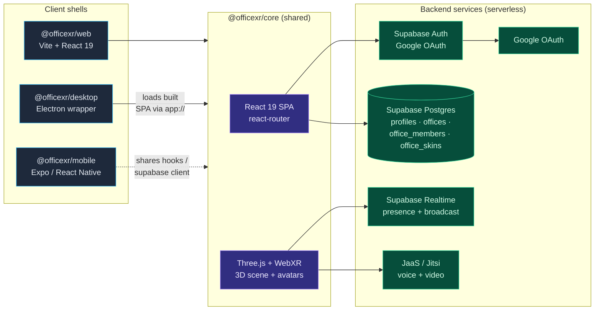
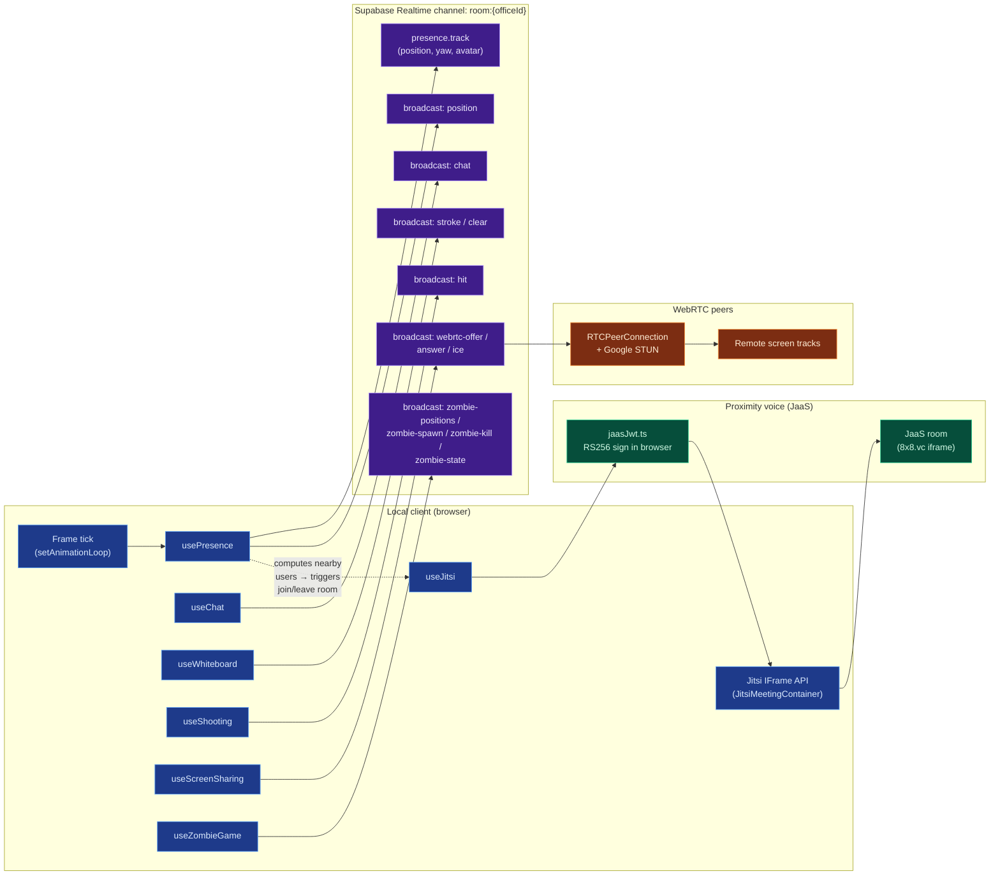
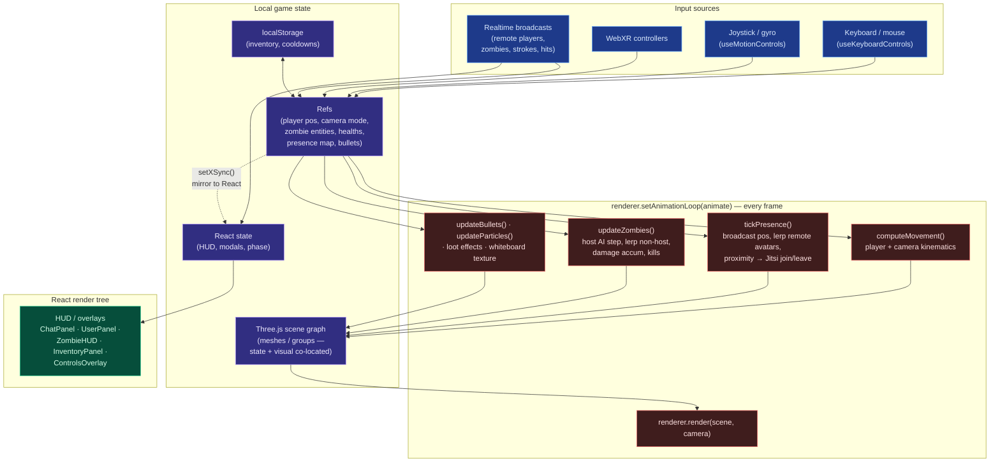

# OfficeXR Architecture

> Living document. Intended as a baseline reference we can use when discussing
> refactors / a "better" architecture in subsequent changes.

OfficeXR is a pnpm monorepo with a single source-of-truth React/Three.js
codebase (`@officexr/core`) wrapped by three platform shells (web, desktop,
mobile). The backend is "serverless" — Supabase handles auth, persistence, and
realtime; JaaS (Jitsi as a Service) handles voice/video. The web client mints
its own JaaS JWT via the Web Crypto API, so there is no custom backend service
to operate.

## 1. System Architecture (clients + backend services)

## 2. Application Layers (inside `@officexr/core`)

The core package is conventional layered React: presentation components →
custom hooks → lib/data → external services. The 3D scene (`RoomScene`) is
the central composition root that wires every subsystem hook together.

```mermaid
flowchart TB
    subgraph Pres["Presentation layer (components/, pages/)"]
        Pages["pages/<br/>Home · Login · RoomPage"]
        Lobby["UserLobby ·<br/>OfficeSelector ·<br/>SettingsPanel"]
        Scene["RoomScene<br/>(3D composition root)"]
        RoomUI["components/room/<br/>ChatPanel · UserPanel ·<br/>InventoryPanel · LootBox ·<br/>JitsiMeetingContainer ·<br/>ScreenShare · LoginModal ·<br/>VirtualJoystick · Crosshair"]
        Three3D["Three.js objects<br/>Avatar · WhiteboardCanvas ·<br/>EmojiConfetti · LootBoxEffect"]
        Zombie["zombie/<br/>ZombieOverlay · ZombieHUD ·<br/>useZombieGame (mini-game)"]
    end

    subgraph Logic["State / hooks layer (hooks/)"]
        Auth["useAuth"]
        SceneHk["useSceneSetup<br/>(renderer, camera, HDRI)"]
        Channel["useRealtimeChannel<br/>(Supabase channel mgr)"]
        Presence["usePresence<br/>(positions, proximity)"]
        Chat["useChat"]
        Jitsi["useJitsi<br/>(proximity voice)"]
        Screen["useScreenSharing<br/>(WebRTC + STUN)"]
        Whiteboard["useWhiteboard"]
        Shoot["useShooting"]
        Loot["useLootBox"]
        Avatar["useAvatarCustomization"]
        Input["useKeyboardControls ·<br/>useMotionControls"]
        Net["useNetworkStats ·<br/>useChannelLogger"]
    end

    subgraph Data["Data / lib layer"]
        Supa["lib/supabase.ts<br/>typed client + Database<>"]
        JWT["lib/jaasJwt.ts<br/>RS256 JWT (Web Crypto)"]
        LootData["data/lootBoxItems.ts"]
        Types["types/<br/>avatar · room"]
    end

    subgraph Ext["External services"]
        SB[("Supabase<br/>Auth + DB + Realtime")]
        JaaSExt["JaaS / Jitsi"]
        WebRTC["Browser WebRTC<br/>(getDisplayMedia, RTCPeer)"]
        LS["localStorage<br/>(inventory, cooldown)"]
    end

    Pages --> Scene
    Pages --> Lobby
    Scene --> RoomUI
    Scene --> Three3D
    Scene --> Zombie

    Scene --> SceneHk
    Scene --> Channel
    Scene --> Presence
    Scene --> Chat
    Scene --> Jitsi
    Scene --> Screen
    Scene --> Whiteboard
    Scene --> Shoot
    Scene --> Loot
    Scene --> Avatar
    Scene --> Input
    Scene --> Net
    Lobby --> Auth
    Pages --> Auth

    Auth --> Supa
    Channel --> Supa
    Presence --> Channel
    Chat --> Channel
    Whiteboard --> Channel
    Screen --> Channel
    Jitsi --> JWT
    Avatar --> Supa
    Loot --> LootData
    Loot --> LS

    Supa --> SB
    JWT --> JaaSExt
    Jitsi --> JaaSExt
    Screen --> WebRTC

    classDef pres fill:#1e3a8a,stroke:#60a5fa,color:#dbeafe
    classDef logic fill:#312e81,stroke:#a78bfa,color:#ede9fe
    classDef data fill:#064e3b,stroke:#34d399,color:#d1fae5
    classDef ext fill:#3f1d1d,stroke:#f87171,color:#fee2e2
    class Pages,Lobby,Scene,RoomUI,Three3D,Zombie pres
    class Auth,SceneHk,Channel,Presence,Chat,Jitsi,Screen,Whiteboard,Shoot,Loot,Avatar,Input,Net logic
    class Supa,JWT,LootData,Types data
    class SB,JaaSExt,WebRTC,LS ext
```

## 3. Realtime, Voice & Media Subsystems

Each room is one Supabase Realtime channel multiplexing several event streams,
plus two out-of-band media subsystems (voice via JaaS iframe, screen sharing
via direct WebRTC peer connections signaled over the same channel).

## 4. Local Game State & Rendering

Yes — there is meaningful local game state, but it is **not cleanly separated
from rendering**. State lives in five different places and is read/written
imperatively from the same animation loop that draws the scene.

### Where state lives today

| Bucket                       | Lifetime          | Triggers React render? | Examples |
|------------------------------|-------------------|------------------------|---------|
| **React `useState`**         | component mount   | Yes                    | `phase`, `wave`, `totalKills`, `playerHealths`, `deadPlayers`, `showLootBox`, `showInventory`, `chatVisible`, `environment`, `zoomLevel`, `followingUserId`, `realtimeRetryAt`, `showLoginModal` |
| **React `useRef` (mutable)** | component mount   | No (read each frame)   | `playerPositionRef`, `cameraRef`, `cameraModeRef`, `keysRef`, `joystickInputRef`, `presenceDataRef`, `avatarsRef`, `avatarTargetsRef`, `avatarPrevPositionsRef`, `bubbleSpheresRef`, `nearbyUserIdsRef`, `phaseRef`, `waveRef`, `zombieEntitiesRef`, `playerHealthsRef`, `localPlayerHpRef`, `isLocalPlayerDeadRef`, `hostIdRef`, `targetZombiePosRef`, `processedKillsRef`, `pauseProximityDetectionRef`, `wbToggleRef`, `fireEmojiRef`, bullet & particle arrays |
| **Three.js scene graph**     | scene lifetime    | No                     | `Avatar` `THREE.Group`s, bubble spheres, whiteboard floor mesh, bullet meshes, confetti sprites, loot-box overhead effects, zombie meshes, HDRI skybox |
| **`localStorage`**           | cross-session     | No                     | `officexr_inventory`, `officexr_lootbox_cooldown`, debug-panel toggle |
| **Supabase Postgres**        | persistent server | No (RPC on mount)      | `profiles`, `offices`, `office_members`, `office_skins` (incl. per-room avatar overrides) |
| **Supabase Realtime**        | ephemeral, room   | Indirect via listeners | live presence, chat broadcasts, whiteboard strokes, hit events, WebRTC signals, zombie host broadcasts |

A consistent pattern in the zombie subsystem (and elsewhere) is that
authoritative state is held in a **ref** (so the animation loop reads it
without stale closures) **and** mirrored into React state via a `setPhaseSync`
/ `setWaveSync` helper purely so the HUD re-renders. The two are kept in sync
manually.

### How rendering is (not) separated

### Observations relevant to a future refactor

Each observation below is **what we see today → why it's a problem →
direction worth exploring**. None of these are urgent bugs; they are
architectural debt that will compound as we add more game-like features
(zombies was the first; loot box, shooting, and whiteboard are similar
shapes).

#### O1. There is no game-state model

- **Today.** State is scattered across ~28 `useRef`/`useState` declarations
  in `RoomScene.tsx` (1,339 lines), ~19 in `usePresence.ts` (763 lines),
  ~27 in `useZombieGame.ts` (555 lines), plus per-hook locals. There is no
  `GameState` type, no store, no reducer. To answer "what is the world right
  now?" you have to read fields off Three.js `Object3D`s, parallel `Map`s
  keyed by entity id, and React state — and reconcile them.
- **Why it hurts.** New features add new refs to `RoomScene`. Cross-cutting
  questions ("who is alive?", "where is everyone?", "what is in my
  inventory?") have no single answer to query. Snapshotting, time-travel
  debugging, save/restore, and server-authoritative replay are all impossible.
- **Direction.** Introduce a single typed `WorldState` (plain data, no
  Three.js types) owned by a small store (Zustand / valtio / a custom
  reducer — anything headless). Hooks become *selectors* and *actions*
  against this store. Three.js becomes a *view* that reads `WorldState` and
  reconciles meshes (the "render = f(state)" pattern that React itself
  popularized, applied to the 3D layer).

#### O2. Simulation and rendering are fused in one animation loop

- **Today.** `RoomScene.animate()` is the only orchestrator: it runs
  `updateParticles`, `updateBullets`, `updateZombies`, `wbUpdateFloorTexture`,
  `computeMovement`, `tickPresence`, ortho-camera lerp, then
  `renderer.render(...)` — in that order, every frame, at whatever framerate
  the browser gives us. There is no fixed-timestep simulation, no separate
  "advance world" vs. "draw world" phase, and no render budget.
- **Why it hurts.** Physics-ish systems (zombie damage accumulation, bullet
  travel, proximity detection) are framerate-dependent. A user on a 30fps
  laptop accumulates damage at a different rate than one on a 144Hz
  display. Network packets arriving between frames mutate the scene graph
  directly with no interpolation/extrapolation buffer. WebXR (which uses its
  own animation loop and render targets) is harder to integrate cleanly.
- **Direction.** Split into three explicit phases:
  1. **Input** (drain ref-buffers, keypresses, joystick, network events).
  2. **Simulate** at a fixed timestep (e.g. 60Hz) operating purely on
     `WorldState`. Networked state (remote players, zombies) gets a
     small interpolation buffer so we render `now − 100ms` smoothly.
  3. **Render** at display rate, syncing Three.js objects to `WorldState`.
  This is the standard
  [Gaffer-on-Games "fix your timestep"](https://gafferongames.com/post/fix_your_timestep/)
  pattern; it costs ~50 lines but eliminates a whole class of FPS-dependent
  bugs.

#### O3. The "ref + state mirror" pattern is a footgun

- **Today.** Anything that needs to drive both the animation loop *and* a
  React HUD is stored twice — e.g. zombie `phase`/`wave`/`totalKills` exist
  as both `phaseRef`/`waveRef`/`totalKillsRef` and `useState` values, kept
  in sync by hand-written setters (`setPhaseSync`, `setWaveSync`).
- **Why it hurts.** Easy to forget the mirror and read a stale value in the
  loop, or update only one side. Doubles the cognitive load of every state
  field.
- **Direction.** With a headless store (O1), refs disappear: the loop reads
  the store directly (no closure-staleness because the store reference is
  stable), and React subscribes via a selector. One source of truth, one
  setter.

#### O4. Three.js bleeds into the "logic" layer

- **Today.** Nine hooks `import * as THREE`. `usePresence.ts` calls
  `scene.add(sphere)`, reads `cameraRef.current.position`, and constructs
  `MeshStandardMaterial`s directly. `useShooting`, `useZombieGame`,
  `useSceneSetup`, `useWhiteboard`, etc. are all similarly intertwined.
- **Why it hurts.** Hooks can't be unit-tested without a Three.js stub
  (today's tests work around this with manual mocks). The "presence" hook
  knows about bubble sphere geometry. Logic isn't portable to a worker or
  a server — the mobile app would need to reimplement everything because it
  doesn't have a Three.js scene.
- **Direction.** Hooks should produce/consume *data* (positions, hp,
  proximity sets) from `WorldState`. A small `SceneRenderer` module owns
  *all* `THREE.*` imports, scene-graph mutation, and reconciliation. This
  also makes the simulation runnable headlessly (server-side anti-cheat,
  or a node-side replay harness).

#### O5. `RoomScene` is a god component

- **Today.** 1,339 lines, 28 ref/state declarations, imports from 14 hooks
  + 12 sibling components, owns the animation loop and most of the
  cross-hook plumbing (e.g. it passes `presenceDataRef` into
  `useZombieGame`, `pauseProximityDetectionRef` *back* into `usePresence`,
  etc.).
- **Why it hurts.** Every feature touches this file. Hooks have to
  thread refs through it just to talk to each other (presence ↔ zombie ↔
  jitsi ↔ shooting). PRs conflict. The "shape" of the app is invisible
  unless you read the whole file top-to-bottom.
- **Direction.** Once O1+O4 land, `RoomScene` shrinks to: mount the store,
  mount the renderer, mount HUD components, run the loop. Cross-hook
  coupling moves from "shared refs threaded through the component" to
  "shared store keys" with explicit subscribers.

#### O6. Networking is an undocumented event grab-bag

- **Today.** A single Supabase channel multiplexes **25+ broadcast event
  types** (`position`, `chat`, `whiteboard-stroke`, `whiteboard-clear`,
  `whiteboard-undo`, `screen-offer`, `screen-answer`, `screen-ice`,
  `screen-stop`, `zombie-start`, `zombie-positions`, `zombie-hit`,
  `zombie-kill`, `zombie-wave-start`, `zombie-end`, `zombie-player-dead`,
  `bubble-prefs`, `avatar-update`, `net-ping`, `net-pong`, `join`, `leave`,
  …). Payloads are `Record<string, unknown>` cast at the receive site.
  There is no schema, no version field, no contract test.
- **Why it hurts.** A typo in an event name fails silently. Adding a field
  to `position` requires touching every sender + receiver and praying. Two
  clients on different deploys can produce undefined behavior.
- **Direction.** Define a tagged union (`type NetEvent = { kind: 'position',
  v: 1, … } | { kind: 'zombie-hit', v: 1, … } | …`), one
  `send(NetEvent)` / `on<Kind>(handler)` API, schema-validated at
  receive (Zod / Valibot). Add a `protoVersion` to presence payloads so
  mismatched-version peers can be filtered or shown a "please refresh"
  banner.

#### O7. Multiplayer authority is ad-hoc

- **Today.** Most events are peer-trusted: any client can broadcast
  `zombie-hit` or `position`. The zombie subsystem elects a host (lex-min
  living player id) to run AI + broadcast positions; non-hosts lerp toward
  received positions. There is no handoff protocol if the host disconnects
  mid-frame, no reconciliation if two clients disagree on state, and no
  authority on hits/kills (the *shooter* declares the hit).
- **Why it hurts.** Network partitions or laggy hosts cause divergent
  worlds. Cheating is trivial. Hit registration favors the shooter, which
  is fine for a sparkle-tag toy but breaks the moment scores matter.
- **Direction.** Two practical paths, in order of cost:
  1. **Document the authority model explicitly** in code (`@authoritative
     local | host | server` per event), and add convergence tests
     (two-client replay → equal `WorldState`).
  2. **Move authority to a small Edge Function / Supabase function** for
     events that affect persistent state (kills, loot, bans). The realtime
     channel stays peer-to-peer for cosmetic stuff (positions, emojis).

#### O8. Persistence is split by trust, not by layer

- **Today.** Server (`profiles`, `offices`, `office_members`,
  `office_skins`) holds identity & membership. **`localStorage`** holds
  `officexr_inventory` and `officexr_lootbox_cooldown`, both of which are
  game-economy values a user can edit with devtools. Game progress
  (zombie wave, kills) is in-memory only — refresh wipes it.
- **Why it hurts.** Users will lose progress on refresh and learn to
  distrust the loot box. The cooldown is enforced client-side only.
  Inventory means nothing if it can't follow you across devices.
- **Direction.** Move "earned" things (inventory, kill counts, season
  stats) to Postgres behind RLS. Keep "preferences" (debug-panel toggle,
  zoom level) in `localStorage`. The simulation tier should treat both
  as "load on join, save on leave / dirty-flag" — not directly read/write
  from inside the animation loop.

#### O9. Cross-platform code is duplicated

- **Today.** `packages/mobile/src/lib/supabase.ts` is a separate Supabase
  client from `packages/core/src/lib/supabase.ts`.
  `packages/mobile/src/hooks/useAuth.ts` re-implements `useAuth`. The
  mobile app shares "types" but not behavior.
- **Why it hurts.** Auth fixes have to be applied twice. Database type
  changes drift between core and mobile. As we add more features, mobile
  will diverge further.
- **Direction.** Extract a platform-agnostic `@officexr/sdk` containing
  the supabase client, auth, store, and simulation — no React, no
  Three.js. `core` (web/desktop) and `mobile` consume it. Three.js stays
  in `core`; mobile picks its own renderer (react-three-fiber on
  expo-gl, native UI, or a webview) without needing to fork logic.

#### O10. Performance & scalability ceilings

- **Today.** (a) Screen sharing is full-mesh WebRTC: N peers ⇒ N²
  connections, bounded by browser limits at ~10–15 sharers in a room.
  (b) Position broadcasts are unthrottled per-frame writes (capped only
  by a `lastPositionUpdate` timestamp inside `usePresence`).
  (c) `useZombieGame` mirrors Maps/Sets into React state, which means
  HUD re-renders on every zombie tick during a wave.
  (d) HDRI EXR is loaded eagerly per scene mount.
- **Why it hurts.** Each is fine at today's user counts (~handful per
  room) and will become the first wall as we grow.
- **Direction.** Track these as known ceilings, not as bugs. When we hit
  ~20 concurrent users per room, the screen-share mesh is the first
  thing to swap (LiveKit / Jitsi SFU). HUD re-render frequency is
  trivially fixed by selector-based subscription (O1).

#### O11. Testing covers hooks in isolation, not the system

- **Today.** `__tests__/hooks/*` mocks Three.js, Supabase channels, and
  exercises individual hooks. There is no "two clients in a room" test,
  no convergence test, no render-snapshot.
- **Why it hurts.** The integration bugs (host election under
  disconnect, presence + jitsi join races, whiteboard stroke ordering
  across reconnect) are exactly the ones unit tests don't catch.
- **Direction.** After O1, a headless `WorldState` makes deterministic
  multi-client sim tests cheap: spin up two stores in one process, pipe
  their network buses to each other, replay a scripted input sequence,
  assert convergence.

### Suggested refactor order

The observations above aren't independent — there is a natural sequence
where each step unlocks the next:

1. **O1** — extract `WorldState` + a headless store. Start with the
   zombie subsystem since it's the most state-heavy and self-contained.
2. **O4** — pull all `THREE.*` usage out of hooks into a
   `SceneRenderer` that reconciles from `WorldState`. Hooks become pure
   logic.
3. **O3** — delete every ref-mirror; loop reads store directly.
4. **O2** — split the loop into input / fixed-step simulate / render.
5. **O6** — typed network event union + schema validation.
6. **O5** — `RoomScene` shrinks to a thin shell.
7. **O7, O8** — server authority + persistent inventory, once the
   simulation has a clean API to plug into.
8. **O9** — extract `@officexr/sdk` and migrate mobile.
9. **O10, O11** — addressed opportunistically as ceilings approach.

## 5. Data Layer (Supabase)

Persistence is a small Postgres schema with row-level security. Access to a
room is gated by the `join_office_if_allowed` RPC, called by `RoomPage`
before mounting the 3D scene.

- `profiles` — one per auth user; default avatar customization fields.
- `offices` — rooms; `environment` selects the 3D scene preset; `link_access`
  toggles open-by-link join.
- `office_members` — membership + role (`owner | admin | member`) +
  per-room avatar overrides.
- `office_skins` — uploaded GLB models attached to an office.
- RPC `join_office_if_allowed(p_office_id)` → `'ready' | 'denied' | 'not-found'`.

SQL migrations live in `supabase/migrations/` and are applied automatically on
push to `main` by `.github/workflows/supabase-migrations.yml`.
