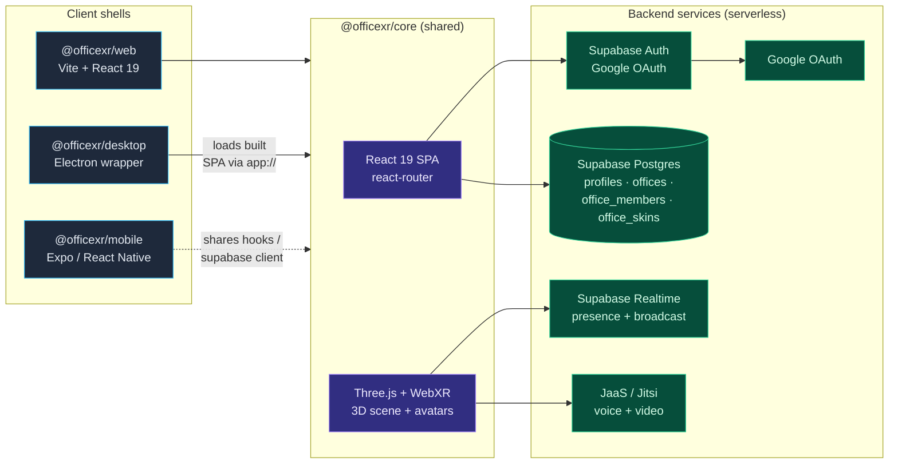
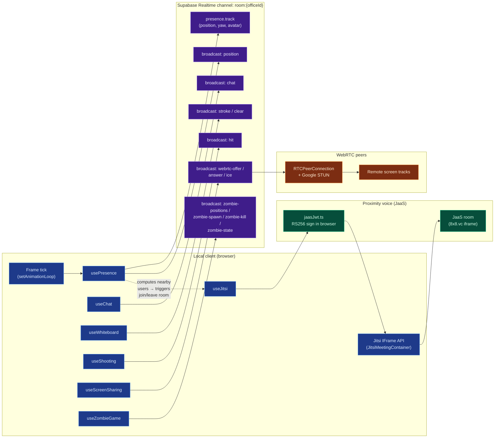
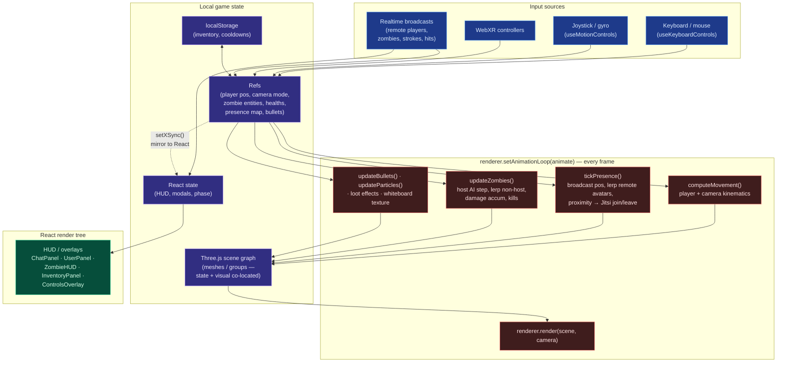

# OfficeXR Architecture

> Living document. Intended as a baseline reference we can use when discussing
> refactors / a "better" architecture in subsequent changes.

OfficeXR is a pnpm monorepo with a single source-of-truth React/Three.js
codebase (`@officexr/core`) wrapped by three platform shells (web, desktop,
mobile). The backend is "serverless" — Supabase handles auth, persistence, and
realtime; JaaS (Jitsi as a Service) handles voice/video. The web client mints
its own JaaS JWT via the Web Crypto API, so there is no custom backend service
to operate.

## 1. System Architecture (clients + backend services)

## 2. Application Layers (inside `@officexr/core`)

The core package is conventional layered React: presentation components →
custom hooks → lib/data → external services. The 3D scene (`RoomScene`) is
the central composition root that wires every subsystem hook together.

```mermaid
flowchart TB
    subgraph Pres["Presentation layer (components/, pages/)"]
        Pages["pages/<br/>Home · Login · RoomPage"]
        Lobby["UserLobby ·<br/>OfficeSelector ·<br/>SettingsPanel"]
        Scene["RoomScene<br/>(3D composition root)"]
        RoomUI["components/room/<br/>ChatPanel · UserPanel ·<br/>InventoryPanel · LootBox ·<br/>JitsiMeetingContainer ·<br/>ScreenShare · LoginModal ·<br/>VirtualJoystick · Crosshair"]
        Three3D["Three.js objects<br/>Avatar · WhiteboardCanvas ·<br/>EmojiConfetti · LootBoxEffect"]
        Zombie["zombie/<br/>ZombieOverlay · ZombieHUD ·<br/>useZombieGame (mini-game)"]
    end

    subgraph Logic["State / hooks layer (hooks/)"]
        Auth["useAuth"]
        SceneHk["useSceneSetup<br/>(renderer, camera, HDRI)"]
        Channel["useRealtimeChannel<br/>(Supabase channel mgr)"]
        Presence["usePresence<br/>(positions, proximity)"]
        Chat["useChat"]
        Jitsi["useJitsi<br/>(proximity voice)"]
        Screen["useScreenSharing<br/>(WebRTC + STUN)"]
        Whiteboard["useWhiteboard"]
        Shoot["useShooting"]
        Loot["useLootBox"]
        Avatar["useAvatarCustomization"]
        Input["useKeyboardControls ·<br/>useMotionControls"]
        Net["useNetworkStats ·<br/>useChannelLogger"]
    end

    subgraph Data["Data / lib layer"]
        Supa["lib/supabase.ts<br/>typed client + Database<>"]
        JWT["lib/jaasJwt.ts<br/>RS256 JWT (Web Crypto)"]
        LootData["data/lootBoxItems.ts"]
        Types["types/<br/>avatar · room"]
    end

    subgraph Ext["External services"]
        SB[("Supabase<br/>Auth + DB + Realtime")]
        JaaSExt["JaaS / Jitsi"]
        WebRTC["Browser WebRTC<br/>(getDisplayMedia, RTCPeer)"]
        LS["localStorage<br/>(inventory, cooldown)"]
    end

    Pages --> Scene
    Pages --> Lobby
    Scene --> RoomUI
    Scene --> Three3D
    Scene --> Zombie

    Scene --> SceneHk
    Scene --> Channel
    Scene --> Presence
    Scene --> Chat
    Scene --> Jitsi
    Scene --> Screen
    Scene --> Whiteboard
    Scene --> Shoot
    Scene --> Loot
    Scene --> Avatar
    Scene --> Input
    Scene --> Net
    Lobby --> Auth
    Pages --> Auth

    Auth --> Supa
    Channel --> Supa
    Presence --> Channel
    Chat --> Channel
    Whiteboard --> Channel
    Screen --> Channel
    Jitsi --> JWT
    Avatar --> Supa
    Loot --> LootData
    Loot --> LS

    Supa --> SB
    JWT --> JaaSExt
    Jitsi --> JaaSExt
    Screen --> WebRTC

    classDef pres fill:#1e3a8a,stroke:#60a5fa,color:#dbeafe
    classDef logic fill:#312e81,stroke:#a78bfa,color:#ede9fe
    classDef data fill:#064e3b,stroke:#34d399,color:#d1fae5
    classDef ext fill:#3f1d1d,stroke:#f87171,color:#fee2e2
    class Pages,Lobby,Scene,RoomUI,Three3D,Zombie pres
    class Auth,SceneHk,Channel,Presence,Chat,Jitsi,Screen,Whiteboard,Shoot,Loot,Avatar,Input,Net logic
    class Supa,JWT,LootData,Types data
    class SB,JaaSExt,WebRTC,LS ext
```

## 3. Realtime, Voice & Media Subsystems

Each room is one Supabase Realtime channel multiplexing several event streams,
plus two out-of-band media subsystems (voice via JaaS iframe, screen sharing
via direct WebRTC peer connections signaled over the same channel).

## 4. Local Game State & Rendering

Yes — there is meaningful local game state, but it is **not cleanly separated
from rendering**. State lives in five different places and is read/written
imperatively from the same animation loop that draws the scene.

### Where state lives today

| Bucket                       | Lifetime          | Triggers React render? | Examples |
|------------------------------|-------------------|------------------------|---------|
| **React `useState`**         | component mount   | Yes                    | `phase`, `wave`, `totalKills`, `playerHealths`, `deadPlayers`, `showLootBox`, `showInventory`, `chatVisible`, `environment`, `zoomLevel`, `followingUserId`, `realtimeRetryAt`, `showLoginModal` |
| **React `useRef` (mutable)** | component mount   | No (read each frame)   | `playerPositionRef`, `cameraRef`, `cameraModeRef`, `keysRef`, `joystickInputRef`, `presenceDataRef`, `avatarsRef`, `avatarTargetsRef`, `avatarPrevPositionsRef`, `bubbleSpheresRef`, `nearbyUserIdsRef`, `phaseRef`, `waveRef`, `zombieEntitiesRef`, `playerHealthsRef`, `localPlayerHpRef`, `isLocalPlayerDeadRef`, `hostIdRef`, `targetZombiePosRef`, `processedKillsRef`, `pauseProximityDetectionRef`, `wbToggleRef`, `fireEmojiRef`, bullet & particle arrays |
| **Three.js scene graph**     | scene lifetime    | No                     | `Avatar` `THREE.Group`s, bubble spheres, whiteboard floor mesh, bullet meshes, confetti sprites, loot-box overhead effects, zombie meshes, HDRI skybox |
| **`localStorage`**           | cross-session     | No                     | `officexr_inventory`, `officexr_lootbox_cooldown`, debug-panel toggle |
| **Supabase Postgres**        | persistent server | No (RPC on mount)      | `profiles`, `offices`, `office_members`, `office_skins` (incl. per-room avatar overrides) |
| **Supabase Realtime**        | ephemeral, room   | Indirect via listeners | live presence, chat broadcasts, whiteboard strokes, hit events, WebRTC signals, zombie host broadcasts |

A consistent pattern in the zombie subsystem (and elsewhere) is that
authoritative state is held in a **ref** (so the animation loop reads it
without stale closures) **and** mirrored into React state via a `setPhaseSync`
/ `setWaveSync` helper purely so the HUD re-renders. The two are kept in sync
manually.

### How rendering is (not) separated

### Observations relevant to a future refactor

- **No game-state model.** There is no single `GameState` object or store
  (Redux/Zustand/ECS). State is scattered across ~20 refs + ~9 useState
  declarations in `RoomScene` alone, plus per-hook internal refs.
- **State and rendering are co-located.** Zombie HP, player HP, bullet
  trajectories, etc. are stored as fields on Three.js `Group`s or in parallel
  ref-Maps keyed by entity id. There is no headless "simulation" you could
  run server-side or in a worker.
- **Two-source-of-truth pattern.** Zombie phase/wave/kills/healths exist as
  both `useRef` and `useState`, kept in sync with manual setter helpers — easy
  to drift.
- **Animation loop is the orchestrator.** `RoomScene.animate()` directly
  calls `tickPresence`, `updateZombies`, `updateBullets`, `wbUpdateFloorTexture`,
  and `renderer.render`. There is no fixed-timestep simulation, no
  interpolation/extrapolation layer, no separation between "advance the world"
  and "draw the world".
- **Networking is partially authoritative.** Zombie AI uses an
  elected-host-broadcasts-positions model (lex-min living player id);
  everything else (presence, hits, strokes) is peer-trusted.
- **Persistence is split by concern, not by layer.** Server: identity,
  membership, avatar customization. Local: inventory, cooldowns. Ephemeral:
  positions and game progress (lost on refresh).

## 5. Data Layer (Supabase)

Persistence is a small Postgres schema with row-level security. Access to a
room is gated by the `join_office_if_allowed` RPC, called by `RoomPage`
before mounting the 3D scene.

- `profiles` — one per auth user; default avatar customization fields.
- `offices` — rooms; `environment` selects the 3D scene preset; `link_access`
  toggles open-by-link join.
- `office_members` — membership + role (`owner | admin | member`) +
  per-room avatar overrides.
- `office_skins` — uploaded GLB models attached to an office.
- RPC `join_office_if_allowed(p_office_id)` → `'ready' | 'denied' | 'not-found'`.

SQL migrations live in `supabase/migrations/` and are applied automatically on
push to `main` by `.github/workflows/supabase-migrations.yml`.
