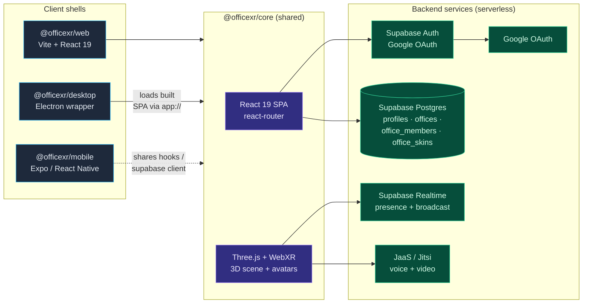
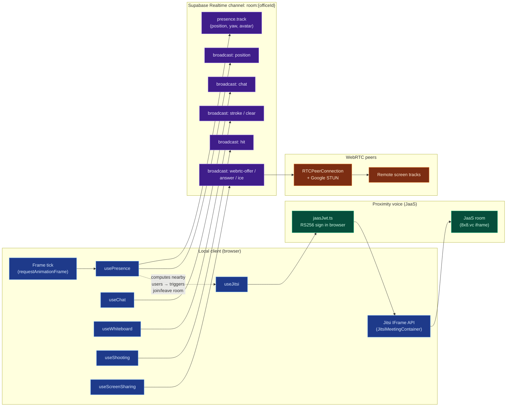
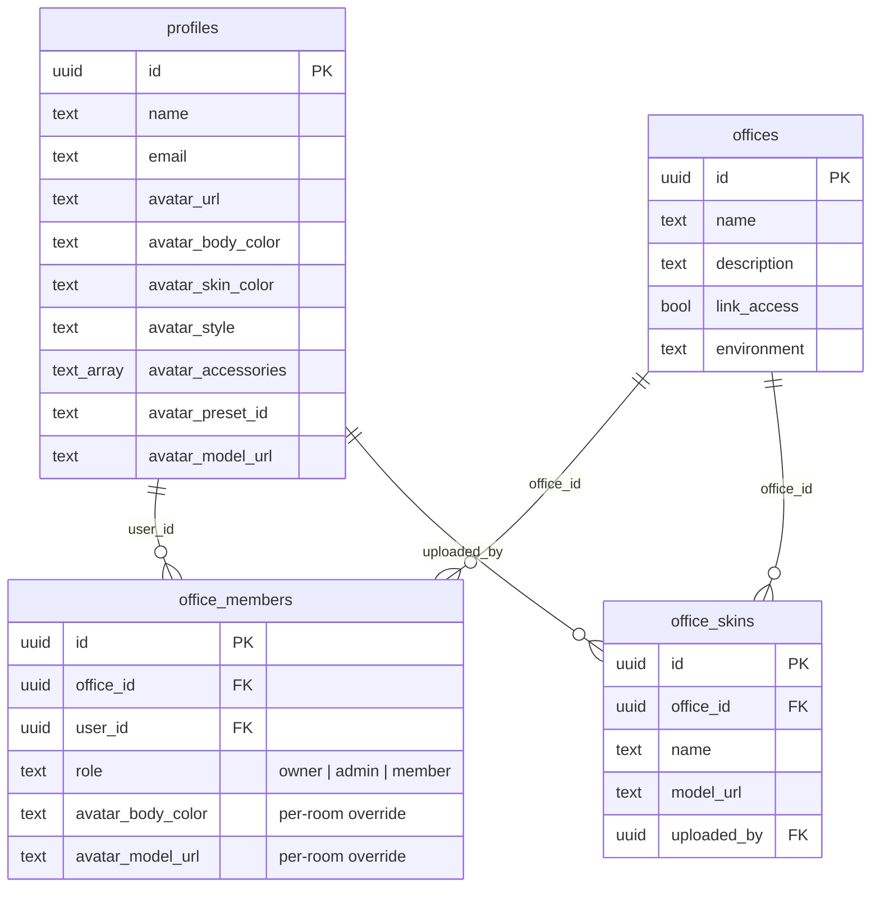

# OfficeXR

A 3D virtual office platform with real-time presence, spatial audio, and avatar customization. Navigate immersive rooms in your browser, desktop app, or VR headset.

## Features

- **Google Authentication** — Supabase Auth with Google OAuth
- **Real-time Presence** — See other users move around in 3D via Supabase Realtime
- **3D Avatars** — Customizable avatars with name labels
- **Proximity Voice Chat** — Jitsi-powered spatial audio that activates when users are near each other
- **Multiple Environments** — Corporate office, cabin, and coffee shop scenes
- **HDRI Skybox** — Photorealistic outdoor panorama for the global lobby
- **WebXR Support** — Full VR support for compatible headsets
- **Desktop App** — Electron wrapper for macOS, Windows, and Linux
- **Mobile App** — Expo/React Native app for iOS and Android

## Tech Stack

| Layer | Technology |
|-------|-----------|
| Web framework | Vite + React 19 |
| 3D rendering | Three.js + WebXR |
| Auth & database | Supabase (PostgreSQL + Realtime) |
| Voice chat | Jitsi as a Service (JaaS) |
| Desktop | Electron + electron-builder |
| Mobile | Expo (React Native) + EAS Build |
| Package manager | pnpm workspaces |

## Architecture

OfficeXR is a pnpm monorepo with a single source-of-truth React/Three.js codebase (`@officexr/core`) wrapped by three platform shells (web, desktop, mobile). The backend is "serverless" — Supabase handles auth, persistence, and realtime, while JaaS (Jitsi as a Service) handles voice/video. The web client mints its own JaaS JWT via the Web Crypto API, so there is no custom backend service to operate.

### 1. System Architecture (clients + backend services)



### 2. Application Layers (inside `@officexr/core`)

The core package is organized as conventional layered React: presentation components → custom hooks → lib/data → external services. The 3D scene (`RoomScene`) is the central composition root that wires every subsystem hook together.

```mermaid
flowchart TB
    subgraph Pres["Presentation layer (components/, pages/)"]
        Pages["pages/<br/>Home · Login · RoomPage"]
        Lobby["UserLobby ·<br/>OfficeSelector ·<br/>SettingsPanel"]
        Scene["RoomScene<br/>(3D composition root)"]
        RoomUI["components/room/<br/>ChatPanel · UserPanel ·<br/>InventoryPanel · LootBox ·<br/>JitsiMeetingContainer ·<br/>ScreenShare · LoginModal ·<br/>VirtualJoystick · Crosshair"]
        Three3D["Three.js objects<br/>Avatar · WhiteboardCanvas ·<br/>EmojiConfetti · LootBoxEffect"]
        Zombie["zombie/<br/>ZombieOverlay · ZombieHUD ·<br/>useZombieGame (mini-game)"]
    end

    subgraph Logic["State / hooks layer (hooks/)"]
        Auth["useAuth"]
        SceneHk["useSceneSetup<br/>(renderer, camera, HDRI)"]
        Channel["useRealtimeChannel<br/>(Supabase channel mgr)"]
        Presence["usePresence<br/>(positions, proximity)"]
        Chat["useChat"]
        Jitsi["useJitsi<br/>(proximity voice)"]
        Screen["useScreenSharing<br/>(WebRTC + STUN)"]
        Whiteboard["useWhiteboard"]
        Shoot["useShooting"]
        Loot["useLootBox"]
        Avatar["useAvatarCustomization"]
        Input["useKeyboardControls ·<br/>useMotionControls"]
        Net["useNetworkStats ·<br/>useChannelLogger"]
    end

    subgraph Data["Data / lib layer"]
        Supa["lib/supabase.ts<br/>typed client + Database<>"]
        JWT["lib/jaasJwt.ts<br/>RS256 JWT (Web Crypto)"]
        LootData["data/lootBoxItems.ts"]
        Types["types/<br/>avatar · room"]
    end

    subgraph Ext["External services"]
        SB[("Supabase<br/>Auth + DB + Realtime")]
        JaaSExt["JaaS / Jitsi"]
        WebRTC["Browser WebRTC<br/>(getDisplayMedia, RTCPeer)"]
        LS["localStorage<br/>(inventory, cooldown)"]
    end

    Pages --> Scene
    Pages --> Lobby
    Scene --> RoomUI
    Scene --> Three3D
    Scene --> Zombie

    Scene --> SceneHk
    Scene --> Channel
    Scene --> Presence
    Scene --> Chat
    Scene --> Jitsi
    Scene --> Screen
    Scene --> Whiteboard
    Scene --> Shoot
    Scene --> Loot
    Scene --> Avatar
    Scene --> Input
    Scene --> Net
    Lobby --> Auth
    Pages --> Auth

    Auth --> Supa
    Channel --> Supa
    Presence --> Channel
    Chat --> Channel
    Whiteboard --> Channel
    Screen --> Channel
    Jitsi --> JWT
    Avatar --> Supa
    Loot --> LootData
    Loot --> LS

    Supa --> SB
    JWT --> JaaSExt
    Jitsi --> JaaSExt
    Screen --> WebRTC

    classDef pres fill:#1e3a8a,stroke:#60a5fa,color:#dbeafe
    classDef logic fill:#312e81,stroke:#a78bfa,color:#ede9fe
    classDef data fill:#064e3b,stroke:#34d399,color:#d1fae5
    classDef ext fill:#3f1d1d,stroke:#f87171,color:#fee2e2
    class Pages,Lobby,Scene,RoomUI,Three3D,Zombie pres
    class Auth,SceneHk,Channel,Presence,Chat,Jitsi,Screen,Whiteboard,Shoot,Loot,Avatar,Input,Net logic
    class Supa,JWT,LootData,Types data
    class SB,JaaSExt,WebRTC,LS ext
```



### 3. Realtime, Voice & Media Subsystems

Each room is one Supabase Realtime channel multiplexing several event streams plus two out-of-band media subsystems (voice via JaaS iframe, screen sharing via direct WebRTC peer connections signaled over the same channel).



### 4. Data Layer (Supabase schema)

Persistence is a small Postgres schema with row-level security; access to a room is gated by the `join_office_if_allowed` RPC, which is what `RoomPage` calls before mounting the 3D scene.



SQL migrations live in `supabase/migrations/` and are applied automatically on push to `main` by `.github/workflows/supabase-migrations.yml`.

## Project Structure

```
officexr/
├── packages/
│   ├── core/                   # @officexr/core — shared application source
│   │   └── src/
│   │       ├── App.tsx
│   │       ├── main.tsx        # Web entry point
│   │       ├── index.ts        # Barrel: platform-agnostic type exports
│   │       ├── index.css
│   │       ├── vite-env.d.ts
│   │       ├── assets/
│   │       │   └── hdri/       # HDRI environment maps (EXR)
│   │       ├── components/
│   │       │   ├── Avatar.tsx
│   │       │   ├── ControlsOverlay.tsx
│   │       │   ├── OfficeSelector.tsx
│   │       │   ├── RoomScene.tsx
│   │       │   ├── SettingsPanel.tsx
│   │       │   └── UserLobby.tsx
│   │       ├── hooks/
│   │       │   ├── useAuth.ts
│   │       │   └── useMotionControls.ts
│   │       ├── lib/
│   │       │   ├── jaasJwt.ts  # JaaS JWT generation (Web Crypto, RS256)
│   │       │   └── supabase.ts # Supabase client + Database types
│   │       ├── pages/
│   │       │   ├── Home.tsx
│   │       │   ├── Login.tsx
│   │       │   └── RoomPage.tsx
│   │       └── types/
│   │           └── avatar.ts
│   ├── web/                    # @officexr/web — Vite browser build
│   │   ├── index.html
│   │   ├── vite.config.ts      # @ alias → ../core/src
│   │   ├── public/             # Static assets
│   │   └── .env.example
│   ├── desktop/                # @officexr/desktop — Electron wrapper
│   │   └── src/
│   │       ├── main.ts
│   │       └── preload.ts
│   └── mobile/                 # @officexr/mobile — React Native / Expo
│       └── src/
│           ├── App.tsx
│           ├── index.ts
│           ├── hooks/useAuth.ts
│           ├── lib/supabase.ts
│           ├── navigation/
│           └── screens/
│               ├── HomeScreen.tsx
│               ├── LoginScreen.tsx
│               └── OfficeScreen.tsx
├── supabase/migrations/        # SQL migrations (applied via Supabase CLI)
├── .github/workflows/
│   └── supabase-migrations.yml # Auto-applies migrations on push to main
├── pnpm-workspace.yaml
└── package.json                # Root scripts
```

## Getting Started

### Prerequisites

- Node.js 18+
- pnpm (`npm install -g pnpm`)
- A [Supabase](https://supabase.com) project
- A [JaaS](https://jaas.8x8.vc) account (for proximity voice chat)

### Installation

```bash
pnpm install
```

### Environment Variables

Copy and fill in `packages/web/.env.example`:

```bash
cp packages/web/.env.example packages/web/.env
```

```env
VITE_SUPABASE_URL=https://your-project.supabase.co
VITE_SUPABASE_PUBLISHABLE_KEY=your-publishable-key
VITE_JAAS_APP_ID=your-jaas-app-id
VITE_JAAS_API_KEY_ID=your-jaas-api-key-id
VITE_JAAS_PRIVATE_KEY=your-jaas-private-key-base64
```

### Database

Apply migrations to your Supabase project:

```bash
supabase link --project-ref <your-project-id>
supabase db push
```

### Run

```bash
pnpm dev        # Web dev server at http://localhost:5173
```

## Controls

### Desktop (keyboard + mouse)

- **W / A / S / D** or **Arrow Keys** — Move
- **Click** — Capture mouse for look-around (pointer lock)
- **Mouse drag** — Look around (after clicking)
- **Esc** — Release mouse

### Mobile

- **Drag** — Look around
- **Virtual joystick** — Move
- **Gyroscope** — Look around by tilting your device (iOS requires permission)

### VR (WebXR)

- Click **Enter VR** in the controls panel
- Use your headset's controllers for navigation

## Building

```bash
# Web
pnpm build                  # outputs to packages/web/dist/

# Desktop
pnpm dist:desktop:mac       # macOS .dmg + .zip
pnpm dist:desktop:win       # Windows installer
pnpm dist:desktop:linux     # Linux .AppImage / .deb / .rpm
pnpm dist:desktop:all       # All platforms

# Mobile (requires EAS CLI)
pnpm build:mobile:ios
pnpm build:mobile:android
```

## License

MIT
