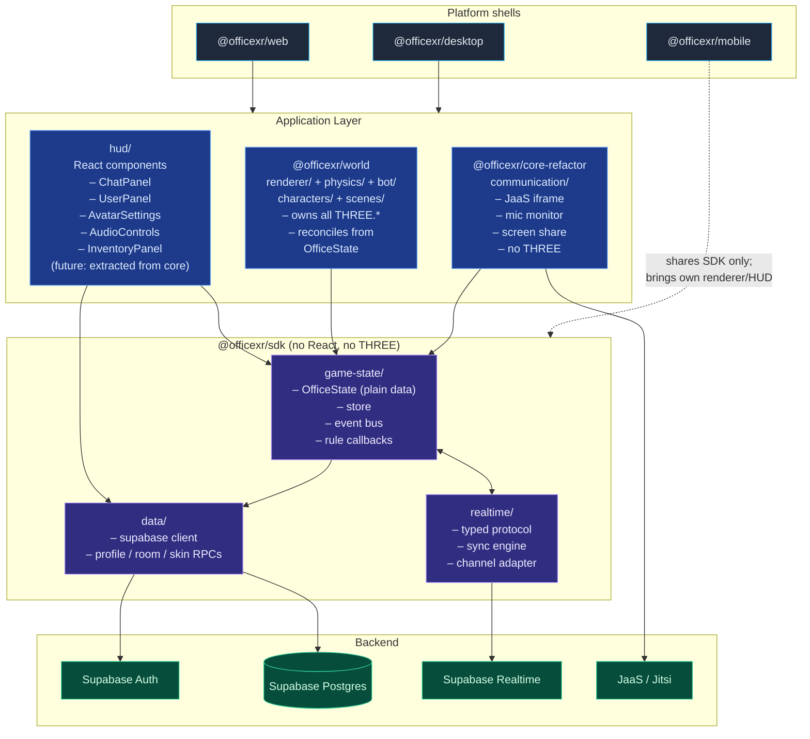

# 00. Target Architecture Overview

## The critical isolation invariant

**Voice and chat must keep working when everything else breaks.**

This is the single most important architectural constraint, because it is
the product. Today, voice (`useJitsi`) is wired through the same React
component tree that owns the renderer, observes proximity by reading
positions from `presenceDataRef` (a side-effect of the render loop), and
shares its lifetime with `RoomScene.tsx`. A renderer crash, a Three.js
exception, or a runaway `setAnimationLoop` will take voice down with it.

After the refactor, the dependency graph is one-way:

```
Communication  ─reads─►  GameState        (subscribes to proximity events)
WorldRenderer  ─reads─►  GameState        (subscribes to entity diffs)
HUD            ─reads─►  GameState        (subscribes to selectors)
Communication  ─does NOT depend on─►  WorldRenderer
WorldRenderer  ─does NOT depend on─►  Communication
```

Concretely:

- `Communication` (the audio/video subsystem) imports nothing from
  `WorldRenderer` and nothing from `three`.
- `Communication` runs in its own React subtree mounted as a sibling of
  `WorldRenderer`, not a child. If the renderer's subtree throws, an
  error boundary contains the damage; the call survives.
- `Communication` listens to `gameState.on('proximity:enter' | 'proximity:exit')`
  for who to talk to. It never queries Three.js positions or scene
  graph nodes.
- A render frame that throws cannot interrupt a Jitsi join/leave, mute
  toggle, or screen-share signaling exchange.

The corollary: if you find yourself adding an `import * as THREE` to
anything under `communication/`, you are about to violate this invariant.

## Target architecture



## Package boundaries

The current `@officexr/core` is split in two:

| Package | Contents | Allowed deps |
|---------|----------|--------------|
| `@officexr/sdk` | GameState store, event bus, realtime protocol, supabase client, typed RPCs | No React. No `three`. Plain TS + `@supabase/supabase-js` + `zod` (or `valibot`). |
| `@officexr/core-refactor` | Communication subsystem (voice / Jitsi), stack factory | React optional. No `three`. Depends on `@officexr/sdk`. |
| `@officexr/world` | Renderer, physics, bots, character registry, scene serialization | React, `three`, `@react-three/fiber`, `@react-three/rapier`. Depends on `@officexr/sdk`. |
| `@officexr/studio` | Authoring app — Debug / Character / Scene mode shells over `@officexr/world`'s renderer | React. Depends on `@officexr/world` + `@officexr/sdk` + `@officexr/core-refactor`. |
| `@officexr/web` | Vite shell (production app) | Currently depends on `@officexr/core` (legacy). Will eventually swap to depend on `@officexr/world` + future HUD package. |
| `@officexr/desktop` | Electron shell | loads built `@officexr/web` |
| `@officexr/mobile` | Expo / React Native | depends on `@officexr/sdk` only — owns its own UI/renderer |

> **Naming note.** Earlier drafts of this plan used `@officexr/app` for
> the renderer + HUD + communication bundle. That single package has
> since been split: `@officexr/core-refactor` owns the communication
> subsystem, and `@officexr/world` owns the renderer + physics + scenes
> + character registry. There is no `@officexr/app` package; references
> to it in older docs map to `@officexr/world` (renderer) or
> `@officexr/core-refactor` (communication) accordingly.

This addresses **O9** (cross-platform duplication): `@officexr/sdk` is
the single home for auth, the realtime protocol, GameState, and DB
types. `core/lib/supabase.ts` and `mobile/src/lib/supabase.ts` collapse
into one. `useAuth` lives once.

## What stays the same

- **Supabase remains the substrate.** No new server-side runtime is
  introduced unless the realtime layer's "server-authoritative for
  economy events" path is taken (see [03-realtime-layer](./03-realtime-layer.md)),
  and that's an Edge Function, not a long-running service.
- **JaaS remains voice/video.** The web client keeps minting its own
  RS256 JWT via `lib/jaasJwt.ts`. That module moves under
  `@officexr/core-refactor`'s communication subsystem since it's a
  client concern, not SDK.
- **Three.js remains the renderer.** It just stops leaking into hook
  signatures.
- **The pnpm monorepo + three-shell layout stays.** Only the
  *contents* of `core` change.

## What changes shape

- **`RoomScene.tsx` is no longer a god component.** It becomes a
  ~100-line composition root that mounts the renderer, the HUD, and
  the communication subtree, and starts the simulation tick. See
  [01-application-layer](./01-application-layer.md).
- **Hooks become selectors.** `usePresence`, `useChat`, `useShooting`,
  `useZombieGame` become thin wrappers over `gameState.subscribe(...)`.
  They no longer own state, no longer touch Three.js, and no longer
  thread refs into `RoomScene`.
- **Network broadcasts become typed events.** The 25+ untyped event
  names collapse into a single tagged-union schema validated at the
  receive site. See [03-realtime-layer](./03-realtime-layer.md).
- **`localStorage` shrinks to user preferences only.** Inventory and
  cooldowns move to Postgres. See [04-persistent-data-layer](./04-persistent-data-layer.md).

## Studio split (landed ahead of web migration)

The `@officexr/studio` authoring tool (formerly `@officexr/debug-app`)
shipped before the full `core` → `world`/`HUD` migration was complete.
It exists as the proving ground for the headless SDK + headless
communication + renderer split, and as a place for creators to author
worlds, characters, and scenes that the production `web` will later
consume.

What landed:

- **`@officexr/world`** (new) holds the renderer (`renderer/`),
  physics (`physics/`), bots (`bot/`), character registry
  (`characters/`), and scene serialization (`scenes/`). All
  `import * as THREE` for the studio path lives here.
- **`@officexr/studio`** (renamed from `debug-app`) is a thin shell
  that mounts `@officexr/world`'s renderer plus three mode surfaces:
  Debug (existing Leva panels), Character (per-model tuning that
  broadcasts via the new `world:characters` `NetEvent`), and Scene
  (interactive map editor that mutates `WorldMap.layers` and persists
  via a generic `SceneStorage` interface — filesystem-backed in dev).
- **SDK extensions:** `OfficeState.characterConfigs`, the
  `world:characters` NetEvent + PROTOCOL entry, and a richer `CubeKind`
  (optional `appearance`) — all generally useful, not studio-specific.

What is **not** done as a result of the studio split:

- `packages/web/` is **untouched**. It still depends on
  `packages/core/`'s legacy `RoomScene.tsx` god component, its own
  `Avatar.tsx`, its own `useJitsi`, etc.
- The `core` → `world` migration of the production renderer is the
  next layer of this work. When it lands, `web` swaps from
  `@officexr/core` to `@officexr/world` (renderer) plus a future
  HUD package extracted from `core/components/`. The studio path
  proves the seams.
- HUD components (Chat, User, Inventory, etc.) still live only in
  `core/`. A future `@officexr/hud` (or `@officexr/world/hud`)
  extraction is in scope for the `web` migration, not for studio.

## Reading order

1. This doc — establishes the invariant and the package layout.
2. [01-application-layer](./01-application-layer.md) — what each of
   the three application subsystems looks like.
3. [02-game-state](./02-game-state.md) — the contract everything else
   subscribes to.
4. [03-realtime-layer](./03-realtime-layer.md) — how GameState stays
   in sync between clients (this is where the "options" discussion
   lives).
5. [04-persistent-data-layer](./04-persistent-data-layer.md) — what
   the database owns.
6. [05-migration-plan](./05-migration-plan.md) — concrete steps.
