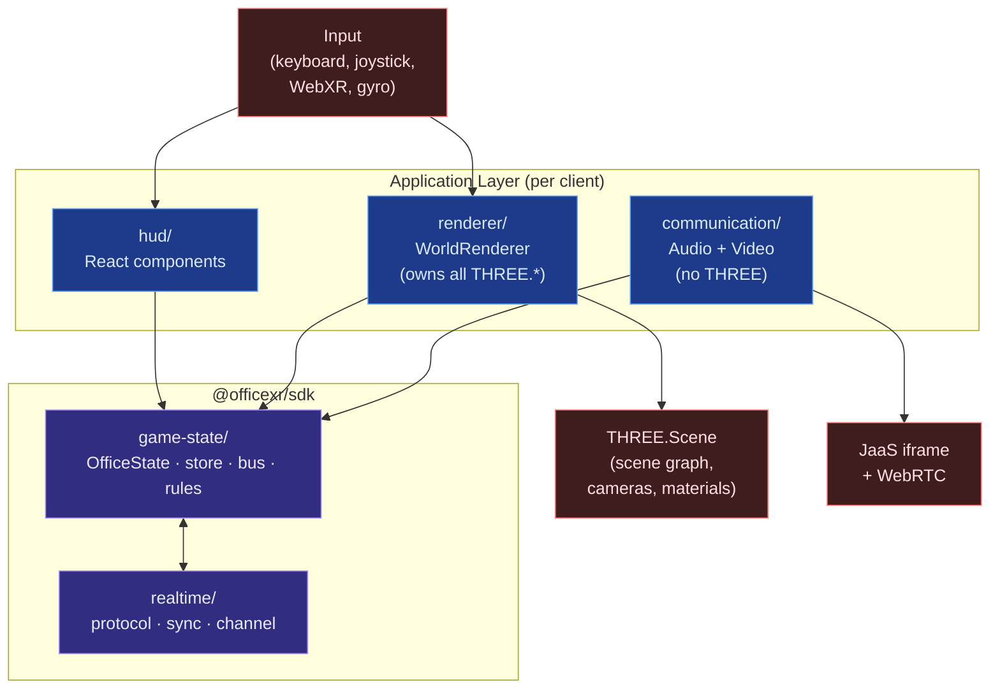

# 01. Application Layer

The application layer is what runs in each user's client. It has three
peer subsystems — **HUD**, **WorldRenderer**, **Communication** — that
all read from the same `OfficeState` and never depend on each other.
This doc specifies what each owns, what it imports, and how
`RoomScene.tsx` shrinks once the layering is in place.

> Addresses observations **O2** (simulation/render fused), **O4**
> (THREE leaks into hooks), **O5** (`RoomScene` god component).

## The shape



The arrows are **one-way**: subsystems never read from each other.
This is what makes the "voice survives renderer crash" invariant
enforceable rather than aspirational.

## Communication (`@officexr/app/communication/`)

This is the **most critical subsystem**. It is the product. It must
keep working when everything else fails.

### What it owns
- JaaS iframe lifecycle (`JitsiMeetingContainer`).
- JaaS RS256 JWT generation (`jaasJwt.ts` moves here from `lib/`).
- Microphone access + RMS level monitor.
- Mute toggle wired to the Jitsi iframe API.
- Screen-share WebRTC peer connections + signaling exchange (offer /
  answer / ICE).
- Connection retry, error reporting, audio decay timers.

### What it reads from `OfficeState`
- `proximity:entering` / `proximity:exiting` events on the bus →
  computes its current Jitsi room (the same lex-min seed used today
  in `useJitsi.handleProximityChange`).
- `screenShares` slice → drives WebRTC offer/answer roles per remote
  peer.
- `selfId`, `selfProfile` → identity for JWT generation.

### What it writes to `OfficeState`
- `setMyJitsiRoom(roomId)` — published as a `presence` field so
  remote clients can match.
- `setScreenShareSignal(...)` — outbound WebRTC signals routed via
  the realtime sync engine.
- `voice:connection-state` mutations (connected, error, retrying)
  read by the HUD's call-status indicator.

### Hard rules
- **No `import * as THREE`**. Tooling enforces this with an ESLint
  rule (`no-restricted-imports` scoped to `communication/**`).
- **No imports from `renderer/`**. Communication does not know that
  a renderer exists.
- **Wrapped in its own `<ErrorBoundary>`**. A throw inside
  `WorldRenderer`'s subtree must not unmount the JaaS iframe. The
  React tree shape guarantees this:
  ```tsx
  <RoomPage>
    <GameStateProvider>
      <ErrorBoundary><WorldRenderer/></ErrorBoundary>
      <ErrorBoundary><HUD/></ErrorBoundary>
      <ErrorBoundary><Communication/></ErrorBoundary>
      <SyncEngine/>
    </GameStateProvider>
  </RoomPage>
  ```
- **Acceptance test:** throw a synthetic error inside `WorldRenderer`
  during a live call; the call audio must continue uninterrupted.

### What media stays here vs goes to renderer
- The `MediaStream` for a remote screen share lives here. The
  reference is published into `OfficeState.screenShares`.
- The renderer reads that reference and wraps it in a
  `THREE.VideoTexture` for in-world display. If the renderer crashes,
  the share keeps streaming; only the in-world plane disappears.

## WorldRenderer (`@officexr/app/renderer/`)

The 3D view of `OfficeState`. Stateless from the outside — its job is
"render = f(state)".

### What it owns
- `THREE.Scene`, `THREE.WebGLRenderer`, `setAnimationLoop`.
- All `THREE.*` imports across the entire codebase. Today nine hooks
  import from `three`; after this refactor, only files under
  `renderer/` do (enforced by ESLint).
- The HDRI skybox loader.
- Avatar `THREE.Group` reconciliation (a `Map<PlayerId, AvatarHandle>`
  that creates/updates/disposes meshes as `OfficeState.players`
  changes).
- Bubble sphere meshes for proximity visualization (no logic — pure
  visual, driven by `OfficeState.proximity`).
- Bullet, particle, loot-effect, whiteboard floor textures.
- Camera modes (first-person, third-person-behind, third-person-front).
- WebXR controller integration.
- Receiver-side **position extrapolation** (see
  [03-realtime-layer](./03-realtime-layer.md)): each frame computes
  `displayPos = pos + vel * (now − tRecv)` for remote players, with
  smoothing on packet arrival and a 500ms freeze cap.

### What it reads from `OfficeState`
- Everything visual: players, proximity, whiteboard, zombies, bullets,
  loot effects, screen-share `MediaStream` references, environment
  preset, self camera mode.

### What it writes to `OfficeState`
- Local input drained into `setSelfPosition`, `setSelfYaw`,
  `setCameraMode`. The renderer is the canonical home for
  keyboard/joystick handlers because those are tightly coupled to
  the camera and viewport.
- `tick(dt)` notifications on the runtime slice so rules can run.

### The frame loop
Three explicit phases per frame, no fixed-timestep simulation yet
(deferred — see [05-migration-plan](./05-migration-plan.md) and O2):

1. **Drain input.** Read keyboard / joystick / XR / gyro buffers,
   issue store mutations for self position and yaw.
2. **Tick.** Advance `runtime.lastTick`. The store fires its
   per-tick rule pass; rules emit events (proximity, combat,
   inventory). Inbound `NetEvent`s queued since last tick are
   applied here.
3. **Render.** Reconcile the scene graph against the current
   `OfficeState` snapshot, then `renderer.render(scene, camera)`.

This phase split is necessary so subsystems get consistent state per
frame: HUD subscribers, communication-bus listeners, and renderer
reconciliation all see the same snapshot.

### Hard rules
- **All THREE imports live here.** Anything else importing `three`
  is a violation.
- **The renderer never queries the realtime layer directly.** It
  reads `OfficeState`. Sync is invisible to it.
- **The renderer never mutates `OfficeState.players[other]`.** Remote
  player state is written exclusively by the sync engine.

## HUD (`@officexr/app/hud/`)

Conventional React components, each subscribing to a narrow
selector. No refs (O3 dies here). No `THREE.*`.

### Components
- `ChatPanel`, `UserPanel`, `AvatarSettings`, `AudioControls`
  (mute, device picker, voice connection state),
  `InventoryPanel`, `LootBox`, `ZombieHUD`,
  `ConnectionStatusBanner` (online/realtime/voice/version-warning),
  `LoginModal`, `VirtualJoystick`, `Crosshair`.
- `AvatarSettings` and `AudioControls` are first-class HUD modules,
  not buried inside today's monolithic `SettingsPanel.tsx`.

### Subscription pattern
With Zustand + `subscribeWithSelector`, each component reads only
the slice it cares about:

```tsx
const myHp = useStore(s => s.players[s.selfId].hp);
const chatMessages = useStore(s => s.chat, shallow);
```

This addresses **O10** (HUD re-renders on every zombie tick): with
selector-based subscription, only the components reading the
mutated slice re-render.

### What HUD writes to `OfficeState`
- User intents: `sendChat(text)`, `openLootBox()`, `pickItem(id)`,
  `toggleMute()`, `setCameraMode(mode)`.
- Settings: `setAvatarPreset(...)`, `setBubblePrefs(...)`.
- These are plain store actions. The sync engine picks them up and
  broadcasts the corresponding `NetEvent` (where appropriate). The
  HUD never calls realtime APIs directly.

## `RoomPage.tsx` after the refactor

`RoomScene.tsx` (1,339 lines today) is replaced by `RoomPage.tsx` —
a thin composition root.

```tsx
export function RoomPage({ officeId }: { officeId: string }) {
  return (
    <GameStateProvider officeId={officeId}>
      <SyncEngine />
      <ErrorBoundary fallback={<RendererCrashed/>}>
        <WorldRenderer />
      </ErrorBoundary>
      <ErrorBoundary>
        <HUD />
      </ErrorBoundary>
      <ErrorBoundary>
        <Communication />
      </ErrorBoundary>
    </GameStateProvider>
  );
}
```

That's it. Roughly 150 lines including imports and prop wiring.
Compare to today's 1,339 lines threading 28 refs across 14 hooks.

The cross-hook plumbing that today exists in `RoomScene` —
`presenceDataRef` flowing into `useZombieGame`,
`pauseProximityDetectionRef` flowing back into `usePresence`, etc. —
disappears entirely. Each subsystem talks to the store; nothing else.

## What this layer does **not** own

- Network protocol — that's [03-realtime-layer](./03-realtime-layer.md).
- State shape and rule semantics — that's
  [02-game-state](./02-game-state.md).
- Persistence — that's
  [04-persistent-data-layer](./04-persistent-data-layer.md).

## Acceptance criteria

A reviewer can confirm this layer is correctly built when:

1. Grep for `from 'three'` returns matches only under
   `@officexr/app/renderer/**`.
2. Grep for `import.*from.*\\bcommunication` returns no matches in
   `renderer/**` and vice versa.
3. Throwing a synthetic error inside `WorldRenderer` during a live
   call leaves the call audio uninterrupted (manual test).
4. `RoomPage.tsx` is under 200 lines and contains no
   `useState`/`useRef` for game state.
5. HUD components subscribe via Zustand selectors; no
   `setPhaseSync`-style mirror functions exist.
