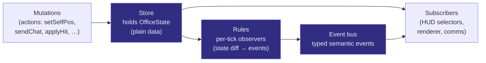
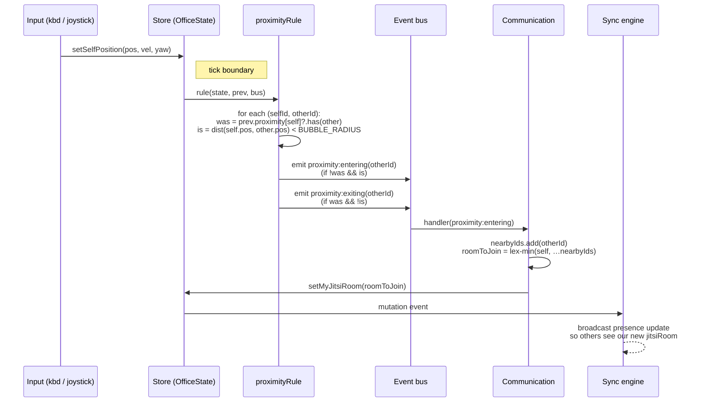

# 02. GameState

`GameState` is the typed, headless source of truth for one client's
view of the room. Every other layer — HUD, renderer, communication,
realtime sync, persistence — reads from it and writes to it through
explicit actions. There is no second copy. No refs mirroring state.
No fields living only in the scene graph.

> Addresses observations **O1** (no game-state model), **O3** (ref +
> state mirror footgun), **O4** (THREE leaks into hooks), **O11**
> (integration tests missing).

## Three pieces



- **Store** holds `OfficeState`, exposes mutations as actions, and
  emits a low-level "store changed" signal.
- **Rules** are pure observer functions. They run once per tick after
  mutations are applied. They read `state` and `prevState`, and emit
  semantic events to the bus. **Rules never mutate state directly.**
- **Bus** is a typed event emitter. Subscribers (communication,
  renderer effects, HUD toasts, persistence write-through) listen for
  semantic events and react.

## OfficeState shape

Plain TypeScript. Lives in `@officexr/sdk/game-state/types.ts`. **No
`THREE.*` types anywhere in this file.**

```ts
type PlayerId = string;

type Vec3 = { x: number; y: number; z: number };

type PlayerState = {
  id: PlayerId;
  name: string;
  pos: Vec3;
  vel: Vec3;          // sender estimate; receivers extrapolate
  yaw: number;
  hp: number;
  isDead: boolean;
  avatar: AvatarData; // model, colors, accessories — already typed
  jitsiRoom: string | null;
  status: 'active' | 'inactive';
  // Receiver-only fields populated by sync; absent on local self:
  tRecv?: number;     // monotonic ms when last position packet arrived
};

type ChatMessage = {
  id: string;
  authorId: PlayerId;
  text: string;
  t: number;
};

type WhiteboardState = {
  strokes: Stroke[];   // append-only, bounded ring (~5000)
  cleared: number;     // monotonic clear epoch for ordering
};

type ZombieState = {
  phase: 'idle' | 'wave' | 'between';
  wave: number;
  totalKills: number;
  hostId: PlayerId | null;
  entities: Record<string, ZombieEntity>;
  playerHealths: Record<PlayerId, number>;
};

type InventoryItem = { id: string; itemId: string; qty: number; acquiredAt: number };

type ScreenShareSignal = {
  ownerId: PlayerId;
  stream: MediaStream | null; // populated only on the share's owner
                              // and on subscribers who answered
  signalState: 'idle' | 'offering' | 'answering' | 'connected' | 'error';
};

type RealtimeState = {
  status: 'connecting' | 'live' | 'reconnecting' | 'snapshot-pending';
  snapshotTarget: PlayerId | null; // who we're requesting from
  versionWarnings: Record<string, number>; // kind → first-seen ts
};

type OfficeState = {
  selfId: PlayerId;
  officeId: string;
  players: Record<PlayerId, PlayerState>;
  proximity: Record<PlayerId, Set<PlayerId>>; // self + others; symmetric
  chat: ChatMessage[];           // bounded ring (~200)
  whiteboard: WhiteboardState;
  zombies: ZombieState;
  inventory: InventoryItem[];
  screenShares: Record<PlayerId, ScreenShareSignal>;
  realtime: RealtimeState;
  runtime: { tickRate: number; lastTick: number; protocolVersion: number };
};
```

This is the canonical shape. Anything not in this object isn't part
of GameState; it's either UI-local state (a panel's `useState` for
"is this menu open"), pure preferences (`localStorage`), or
persisted data not yet hydrated.

## Store choice: Zustand with `subscribeWithSelector`

Recommended. Reasons:

- Headless. Works without React; the renderer reads the bare store
  outside React, the HUD reads via the React hook.
- Selector subscription means HUD components re-render only when
  their selected slice changes. Directly fixes O10's "HUD re-renders
  on every zombie tick".
- Tiny dependency, well-understood, easy to swap for a custom
  reducer if it proves unsuitable.
- Plays nicely with mutation events — Zustand exposes a
  `subscribe(listener, selector?)` that the sync engine and rules
  pass use.

A hand-rolled reducer is also acceptable. The architecture doesn't
depend on which one ships. The store API the rest of the system
sees is small:

```ts
interface Store<S> {
  getState(): S;
  setState(updater: (s: S) => Partial<S>): void;
  subscribe<T>(selector: (s: S) => T, listener: (t: T, prev: T) => void): () => void;
  subscribeAll(listener: (s: S, prev: S) => void): () => void;
}
```

## Mutations (actions)

State changes go through named actions colocated with the store.
Two kinds:

- **Local intents** issued by HUD or input: `sendChat(text)`,
  `setSelfPosition(pos, vel, yaw)`, `openLootBox()`, `applyHit(targetId, dmg)`.
  These can mutate freely.
- **Remote applications** issued by the sync engine after validating
  an inbound `NetEvent`: `applyRemotePosition(playerId, pos, vel, yaw, t)`,
  `applyRemoteChat(msg)`, `applyZombieState(...)`.

**Actions never call out to the network.** The sync engine subscribes
to mutations and decides what to broadcast (this is decision #7, the
store-mediated sync model). Feature code calls actions; sync picks
up the deltas.

## Event bus

Typed, in-process, synchronous. Lives in
`@officexr/sdk/game-state/bus.ts`.

```ts
type GameEvent =
  | { kind: 'player:join'; playerId: PlayerId }
  | { kind: 'player:leave'; playerId: PlayerId }
  | { kind: 'player:moved'; playerId: PlayerId; pos: Vec3; yaw: number }
  | { kind: 'proximity:entering'; otherId: PlayerId }
  | { kind: 'proximity:entered'; otherId: PlayerId }
  | { kind: 'proximity:exiting'; otherId: PlayerId }
  | { kind: 'proximity:exited'; otherId: PlayerId }
  | { kind: 'chat:message'; msg: ChatMessage }
  | { kind: 'whiteboard:stroke'; stroke: Stroke }
  | { kind: 'combat:hit'; targetId: PlayerId; dmg: number; byId: PlayerId }
  | { kind: 'combat:killed'; targetId: PlayerId; byId: PlayerId }
  | { kind: 'inventory:added'; item: InventoryItem }
  | { kind: 'inventory:removed'; itemId: string }
  | { kind: 'voice:room-changed'; roomId: string | null }
  | { kind: 'realtime:version-warning'; kind: string }
  | { kind: 'realtime:status-changed'; status: RealtimeState['status'] };

interface Bus {
  emit(event: GameEvent): void;
  on<K extends GameEvent['kind']>(
    kind: K,
    handler: (event: Extract<GameEvent, { kind: K }>) => void,
  ): () => void;
}
```

Synchronous emission is intentional. When a rule emits
`proximity:entering`, the communication subsystem must see it before
the next tick decides we've already entered. Async (microtask)
emission would let "entering" and "entered" race.

## Rules

A `Rule` is a pure function:

```ts
type Rule = (state: OfficeState, prev: OfficeState, bus: Bus) => void;
```

Rules run once per tick, in registration order, after mutations are
applied for that tick. They are observers: they read both the new
state and the previous state and emit events for state transitions.

**Why rules can't mutate state.** If a rule mutated state during
its run, the next rule would see partially-updated state. Worse,
the rule could trigger another mutation that retriggers itself.
Pure observation eliminates this whole class of bugs and makes
rules trivially testable: `expect(bus.emitted).toEqual([...])`
given `(state, prev)`.

**How a "reaction" works.** A rule that wants to "react" to a state
change emits a semantic event. A separate **reducer subscriber**
listens for that event and calls a store action. One indirection,
crystal-clear data flow:

```
mutation → rule → bus.emit('combat:killed') → reducer → store.applyKill(...) → next tick
```

Reducers are colocated with feature code, not with rules. This
separation is what makes the system testable: rules without
reducers are pure; reducers without rules are pure store actions.

## Worked example: proximity → voice

This is the central use case the user called out. End-to-end:



Concretely, the proximity rule body:

```ts
const proximityRule: Rule = (state, prev, bus) => {
  const self = state.players[state.selfId];
  if (!self) return;
  const prevSet = prev.proximity[state.selfId] ?? new Set();
  const nextSet = new Set<PlayerId>();

  for (const [id, other] of Object.entries(state.players)) {
    if (id === state.selfId) continue;
    const d = dist(self.pos, other.pos);
    if (d < BUBBLE_RADIUS) nextSet.add(id);
  }

  for (const id of nextSet) {
    if (!prevSet.has(id)) bus.emit({ kind: 'proximity:entering', otherId: id });
    else bus.emit({ kind: 'proximity:entered', otherId: id });
  }
  for (const id of prevSet) {
    if (!nextSet.has(id)) bus.emit({ kind: 'proximity:exiting', otherId: id });
  }

  // Note: we don't write nextSet here — that's a reducer's job.
};
```

The `proximity` slice in `OfficeState` is updated by a reducer
subscribed to `proximity:entering` / `proximity:exiting`. This keeps
the rule pure and makes "did proximity change between t1 and t2"
trivially answerable from state diffs.

The communication subsystem subscribes to `proximity:*` and never
reads `state.players[*].pos` itself. This is what makes voice
testable in isolation: feed it scripted proximity events and assert
its Jitsi-room decisions.

## Late joiners and the snapshot

When a client joins, its `OfficeState` is empty except for `selfId`
and `officeId`. The realtime layer ([03](./03-realtime-layer.md))
performs a snapshot handshake to populate it before live events
flow. The `OfficeState` shape is designed to be JSON-serializable
for exactly this purpose:

- `Map`s and `Set`s are serialized as arrays/objects on the wire.
- `MediaStream`s in `screenShares` are not snapshotted — they
  re-establish via WebRTC offers after snapshot apply.
- `tRecv` and other receiver-only fields are reset on snapshot apply.

## Killing the ref-mirror pattern (O3)

Today's `phaseRef`/`setPhaseSync`/`waveRef`/`setWaveSync`/etc.
disappear because:

- The renderer reads `store.getState()` directly each frame. The
  store reference is stable, so there is no closure-staleness
  problem the refs were working around.
- The HUD subscribes via selectors. Re-renders happen automatically
  when the selected slice changes.
- Rules read both `state` and `prev` per tick — no need for a ref to
  capture "what was it last frame".

Net effect: every `setXSync` helper in `useZombieGame` and
neighbours is deleted. State has one home.

## Hooks become selectors

Today's `usePresence`, `useChat`, `useShooting`, `useLootBox`,
`useZombieGame` etc. become thin wrappers over the store:

```ts
// before
const presence = usePresence({ officeId, channelRef, … });
// after
const presence = useStore(s => ({ players: s.players, proximity: s.proximity }));
```

Or, if a hook is just a wrapper around a selector, callers can
import `useStore` directly. The hooks layer flattens significantly.

## Testing strategy

GameState is the place where deterministic tests live. The plain-data
shape + pure rules + synchronous bus make the following cheap:

- **Rule tests:** call `rule(state, prev, bus)`, assert emissions.
  No timers, no async, no mocks.
- **Reducer tests:** dispatch an action, assert the resulting state.
- **Two-client convergence test (O11):** instantiate two stores in
  one process, pipe one's outbound `NetEvent`s into the other's
  inbound queue and vice versa, replay a scripted input sequence,
  assert `clientA.getState()` and `clientB.getState()` agree on
  player positions, chat history, and proximity.

## Acceptance criteria

1. `OfficeState` is a single typed object with no `THREE.*` types.
2. `phaseRef`, `setPhaseSync`, `waveRef`, `setWaveSync`, and
   equivalent ref-mirror helpers do not exist anywhere in the
   repo.
3. Rules are pure: a property-based test that calls a rule twice
   on the same `(state, prev)` produces identical bus emissions.
4. The proximity worked example above runs end-to-end with no
   `THREE.*` import in the path from input → store → rule → bus →
   communication → store mutation.
5. A two-client convergence test exists and passes.
