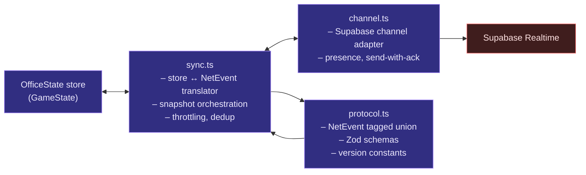
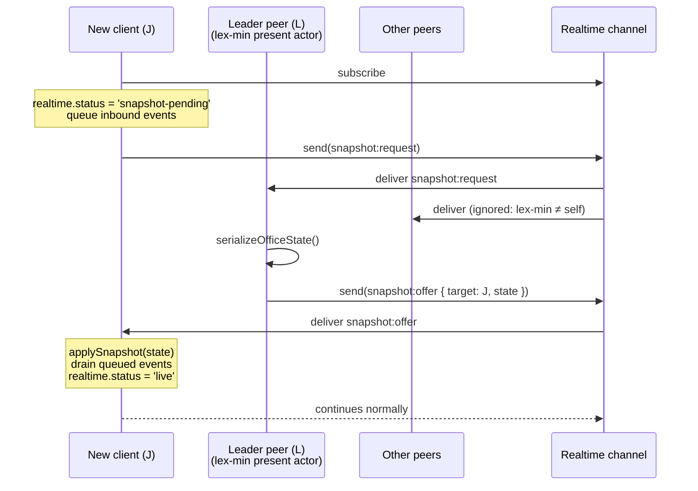

# 03. Realtime Layer

The realtime layer keeps every client's `OfficeState` in agreement
about the room. It is the bridge between local actions and remote
state. Everything in this doc is a confirmed design decision; this is
a specification, not an options menu.

> Addresses observations **O6** (untyped network grab-bag), **O7**
> (ad-hoc multiplayer authority), **O10** (unthrottled position
> broadcasts).

## Layer shape



All three modules live in `@officexr/sdk/realtime/`:

- `protocol.ts` — schema definitions, type exports, version
  constants.
- `channel.ts` — thin Supabase wrapper. Replaces today's
  `useRealtimeChannel`.
- `sync.ts` — the brain. Subscribes to store mutations, encodes
  outbound events, applies inbound events as patches, runs the
  snapshot handshake.

## The single channel

One Supabase channel per office: `office:{officeId}`. Status quo,
keep it. Supabase Realtime handles the mux fine; sharding gains
nothing.

```ts
const channel = supabase.channel(`office:${officeId}`, {
  config: {
    presence: { key: userId },
    broadcast: { ack: true, self: false },
  },
});
```

Presence (Supabase's built-in) is reused for join/leave detection.
Broadcast carries every `NetEvent`. There is exactly one
`channel.subscribe()` per client, owned by the channel adapter.

## NetEvent protocol

Single tagged union. Every event has the same envelope:

```ts
type Envelope = {
  kind: string;        // e.g. 'presence:position'
  v: number;           // schema version of this kind
  actorId: PlayerId;   // who originated it
  seq: number;         // per-actor monotonic, for idempotent dedup
  t: number;           // sender's wall-clock ms (Date.now())
};

type NetEvent = Envelope & (
  | { kind: 'presence:position', v: 1, pos: Vec3, vel: Vec3, yaw: number }
  | { kind: 'avatar:update',     v: 1, avatar: AvatarData }
  | { kind: 'chat:message',      v: 1, text: string }
  | { kind: 'whiteboard:stroke', v: 1, stroke: Stroke }
  | { kind: 'whiteboard:clear',  v: 1, epoch: number }
  | { kind: 'whiteboard:undo',   v: 1, strokeId: string }
  | { kind: 'shot:hit',          v: 1, targetId: PlayerId, dmg: number }
  | { kind: 'loot:open',         v: 1, itemId: string }
  | { kind: 'zombie:state',      v: 1, ... /* host-broadcast snapshot */ }
  | { kind: 'zombie:spawn',      v: 1, ... }
  | { kind: 'zombie:kill',       v: 1, zombieId: string, byId: PlayerId }
  | { kind: 'zombie:wave-start', v: 1, wave: number }
  | { kind: 'zombie:end',        v: 1 }
  | { kind: 'zombie:player-dead',v: 1, playerId: PlayerId }
  | { kind: 'screen:offer',      v: 1, targetId: PlayerId, sdp: string }
  | { kind: 'screen:answer',     v: 1, targetId: PlayerId, sdp: string }
  | { kind: 'screen:ice',        v: 1, targetId: PlayerId, candidate: any }
  | { kind: 'screen:stop',       v: 1 }
  | { kind: 'bubble:prefs',      v: 1, prefs: BubblePrefs }
  | { kind: 'net:ping',          v: 1, nonce: string }
  | { kind: 'net:pong',          v: 1, nonce: string }
  | { kind: 'snapshot:request',  v: 1 }
  | { kind: 'snapshot:offer',    v: 1, target: PlayerId, state: SerializedOfficeState }
);
```

Validated with **Zod** at receive (or valibot if footprint matters
more — pick at implementation time). The validator is the only
thing that decides whether an inbound payload becomes an applied
mutation. There is no `Record<string, unknown>` cast anywhere.

### Versioning

Every kind has its own `v` number, bumped on incompatible changes
to its payload. Receivers compare; mismatched versions are dropped
(see "Schema mismatch" below). A second-level `protocolVersion`
field lives in presence and is shown in connection diagnostics so
operators can spot deploys mid-roll.

### Authority annotations

Each kind declares its authority in metadata. **Documented only —
not enforced server-side** (per the user's call: cheating remains
trivial, and that is intentional for an office tool).

| kind | authority |
|---|---|
| `presence:position`, `avatar:update`, `chat:message`, `whiteboard:*`, `screen:*`, `bubble:prefs`, `net:*` | `local` (the actor) |
| `shot:hit`, `loot:open` | `local` (peer-trusted) |
| `zombie:*` | `host` (lex-min living player) |
| `snapshot:request` | `local` |
| `snapshot:offer` | `local` (only sent by elected snapshot leader) |

Authority lives next to the schema:

```ts
export const PROTOCOL = {
  'presence:position': { v: 1, schema: ZPresencePosition, authority: 'local' },
  'shot:hit':          { v: 1, schema: ZShotHit,          authority: 'local' },
  'zombie:state':      { v: 1, schema: ZZombieState,      authority: 'host' },
  // …
} as const;
```

## Channel adapter (`channel.ts`)

Replaces `useRealtimeChannel`. Headless. Plain class.

```ts
class RealtimeChannel {
  constructor(private supabase, private officeId, private userId) {}
  subscribe(): Promise<void>;            // single subscribe; idempotent
  send(event: NetEvent): Promise<void>;  // ack-required broadcast
  on(handler: (event: NetEvent) => void): () => void;
  trackPresence(data: PresenceData): void;
  onPresenceChange(handler: (joined, left) => void): () => void;
  close(): void;
}
```

The adapter knows nothing about the store. It validates inbound
payloads through Zod and forwards either a `NetEvent` or a
"version-warning" notice. The sync engine wires it up.

## Sync engine (`sync.ts`)

The translator. Runs continuously while the room is mounted.

### Outbound: store → NetEvent

Subscribes to store mutation events. Per-kind outbound policy:

#### `presence:position` — delta-triggered with velocity

The decision was: **idle players cost zero bandwidth; continuously
moving players send at a bounded rate; receivers extrapolate using
the velocity vector for smoothness; a stop-packet halts
extrapolation when motion ends.**

```ts
function maybeBroadcastPosition(state: OfficeState) {
  const me = state.players[state.selfId];
  const now = performance.now();
  const dt = now - lastSentT;
  const dPos = distance(me.pos, lastSentPos);
  const dYaw = angleDelta(me.yaw, lastSentYaw);

  // Estimated velocity since last send (used by receivers to extrapolate)
  const vel = dt > 0 ? scaleDiv(sub(me.pos, lastSentPos), dt / 1000) : ZERO;

  const exceeded = dPos > Δp || dYaw > Δy;
  const aboveCeiling = dt < (1000 / MAX_HZ); // 30Hz hard ceiling

  if (exceeded && !aboveCeiling) {
    send({ kind: 'presence:position', v: 1, ..., pos: me.pos, vel, yaw: me.yaw });
    lastSentPos = me.pos; lastSentYaw = me.yaw; lastSentT = now;
    wasMoving = true;
    return;
  }

  // Stop-detection: we were moving last packet; we're now under threshold;
  // emit one final vel=0 packet so receivers stop extrapolating.
  if (wasMoving && !exceeded && dt > STOP_GRACE_MS) {
    send({ kind: 'presence:position', v: 1, ..., pos: me.pos, vel: ZERO, yaw: me.yaw });
    lastSentPos = me.pos; lastSentYaw = me.yaw; lastSentT = now;
    wasMoving = false;
  }
}
```

Suggested constants (tunable):

| Constant | Value | Purpose |
|----------|-------|---------|
| `Δp` | 0.05 m | position delta threshold |
| `Δy` | 0.05 rad (~3°) | yaw delta threshold |
| `MAX_HZ` | 30 | hard ceiling on send rate |
| `STOP_GRACE_MS` | 100 ms | quiet before declaring stop |

Net effect for a typical office: a stationary user sends 0
packets/sec. A walking user sends ~10–15/sec. A user spinning their
camera quickly is capped at 30/sec.

#### Other kinds — send on mutation

`chat:message`, `whiteboard:stroke`, `shot:hit`, `loot:open`,
`avatar:update`, `screen:*`, `bubble:prefs`, `zombie:*` (when host)
all broadcast immediately when their corresponding store mutation
fires. The `seq` counter increments per send.

### Inbound: NetEvent → store

```ts
channel.on(event => {
  if (versionMismatch(event)) {
    bus.emit({ kind: 'realtime:version-warning', kind: event.kind });
    return;
  }
  if (isDuplicate(event.actorId, event.seq)) return;
  applyNetEventToStore(event);
});
```

Each event kind maps to one store action. Examples:

| Event | Store action |
|-------|-------------|
| `presence:position` | `applyRemotePosition(actorId, pos, vel, yaw, t)` |
| `chat:message` | `appendChat({ id: hash(actorId, seq), authorId, text, t })` |
| `whiteboard:stroke` | `appendStroke(stroke)` |
| `shot:hit` | `applyHit(targetId, dmg, byId=actorId)` |
| `zombie:state` | `applyZombieState(state)` (host-authoritative) |
| `screen:offer` | `setScreenShareSignal({ ownerId: actorId, signalState: 'offering' })` + signal payload routed to comms |
| `snapshot:request` | (handled by snapshot orchestrator, see below) |
| `snapshot:offer` | (handled by snapshot orchestrator) |

### Receiver-side position handling

Owned by the renderer (so the smoothing can run at frame rate), not
by the sync engine — but the contract is defined here:

- Sync writes `players[id].pos`, `players[id].vel`, `players[id].yaw`,
  `players[id].tRecv = now`.
- Renderer each frame computes
  `displayPos = pos + vel * (now − tRecv)`.
- On a new packet, the renderer smoothly lerps `displayPos` to the
  new authoritative `pos` over ~100 ms, then resumes extrapolation
  with the new vector.
- If `now − tRecv > 500 ms`, freeze: the sender is presumed
  disconnected or tab-throttled.

## Snapshot-on-join

Late joiners reconstitute `OfficeState` via a one-shot handshake.
There is no persistent log; snapshots are the resync mechanism.



Algorithm details:

- **Leader election:** every receiver computes
  `lex-min(presentActors except requester)`. Only the leader
  responds. This is deterministic and host-handover-safe (see O7).
- **Queueing window:** between subscribe and snapshot apply, the new
  client buffers all inbound `NetEvent`s. After `applySnapshot`,
  the queue is drained (events with `(actorId, seq)` already
  reflected in the snapshot are deduped via the per-actor seq
  table the snapshot includes).
- **Timeout:** if no `snapshot:offer` arrives within ~3 s, the new
  client retries up to 3 times, then proceeds with an empty state
  and surfaces a "Couldn't sync with peers — some recent activity
  may be missing" banner. Live events still stream.
- **Reconnect:** the same handshake runs after a reconnect; dedup by
  `(actorId, seq)` ensures applied events aren't re-applied.

### What the snapshot contains

A serialized `OfficeState` minus runtime-only fields:

- `players` (full), `proximity` (as arrays), `chat` (last N), `whiteboard.strokes`,
  `zombies`, `screenShares` metadata (no `MediaStream` references).
- Per-actor latest `seq` table for dedup.
- `realtime.protocolVersion` for sanity.

`MediaStream` references are not snapshottable. After snapshot
apply, the new client emits its own `screen:offer` if it has a
share, and other peers re-establish WebRTC connections to it.

## Schema mismatch handling

Decision was: **drop event + visible HUD warning**, once-per-kind
per session.

```ts
function versionMismatch(event: NetEvent): boolean {
  const expected = PROTOCOL[event.kind]?.v;
  return expected === undefined || expected !== event.v;
}

// In sync.ts:
if (versionMismatch(event)) {
  if (!warned.has(event.kind)) {
    warned.add(event.kind);
    bus.emit({ kind: 'realtime:version-warning', kind: event.kind });
  }
  return;
}
```

The `realtime:version-warning` event lights up a dismissible banner
in the HUD: *"A peer is on a different version — some features may
not work. Refresh to update."* One banner per kind per session.
This addresses the silent-failure mode in O6.

## Authority and host handover

Documented, not enforced.

- **Position, chat, whiteboard, screen-share signaling, voice room
  hint:** the actor is authoritative for their own data. Any peer
  may broadcast these; receivers always trust the actor.
- **Hits and loot:** peer-trusted. The shooter declares the hit; the
  loot-opener declares the open. A bad actor with devtools can
  fabricate kills. Acceptable for an office tool; documented in
  the doc and in code comments next to the schema.
- **Zombies:** the host (lex-min living player) is authoritative.
  When the host disconnects, every remaining client computes the
  new host independently. To handle the gap, the new host:
  1. Begins broadcasting `zombie:state` immediately on detection.
  2. Older `zombie:state` events from the previous host are dropped
     by `(actorId, seq)` dedup once the new host's events arrive.
- **Add a per-event authority lint:** when a `zombie:state` event
  arrives whose `actorId` is not the current lex-min living player,
  log a warning. Don't drop — the dropping policy would amplify
  partition disagreements. Visibility is enough.

## Performance ceilings (O10)

Where this layer sits relative to the listed ceilings:

- **Position broadcast rate:** addressed (delta + ceiling).
- **Screen-share full-mesh WebRTC:** unchanged. The signaling moves
  into the typed protocol, but the topology is still N². The
  realtime layer is shaped to make swapping to LiveKit/Jitsi SFU a
  drop-in replacement of the screen-share signaling kinds plus the
  comms subsystem — no `OfficeState` changes required.
- **HDRI eager load:** outside this layer's concern (renderer).

## Module boundaries

| Module | Imports | Forbidden |
|--------|---------|-----------|
| `protocol.ts` | `zod`, types from `game-state/types.ts` | React, three, supabase |
| `channel.ts` | `@supabase/supabase-js`, `protocol.ts` | React, three, store |
| `sync.ts` | `protocol.ts`, `channel.ts`, store | React, three |

## Acceptance criteria

1. No `supabase.channel(...).send({ type: 'broadcast', event: '<some
   string>' })` exists outside `realtime/`. All sends go through
   `RealtimeChannel.send(event: NetEvent)`.
2. Every kind in the protocol table has a Zod schema and a
   `v: number`. CI fails if a `kind` is added without both.
3. Two clients in the same office, one of which reloads mid-game,
   converge on the same `OfficeState` after the snapshot handshake
   completes (covered by the convergence test from
   [02-game-state](./02-game-state.md)).
4. A stationary client broadcasts 0 `presence:position` packets per
   minute (verified in dev with the network debug panel).
5. A walking-then-stopping client emits exactly one final
   `vel = 0` packet within `STOP_GRACE_MS` of stopping, and remote
   renderers do not overshoot the stop point.
6. Sending an event with an unknown `v` to a peer surfaces the
   version-warning HUD banner exactly once per session per kind.
