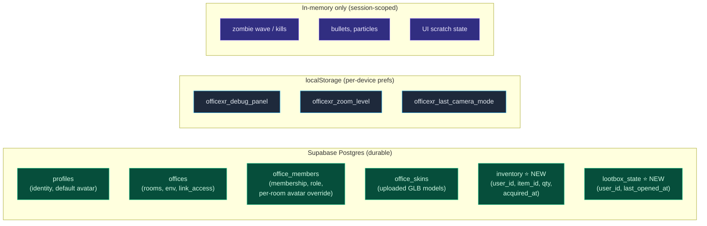

# 04. Persistent Data Layer

The persistent data layer is what survives a refresh. Today it's
split by **trust** rather than by **layer** — server (Supabase
Postgres) holds identity and membership, but `localStorage` holds
inventory and loot-box cooldowns, both of which are user-editable
in devtools. This doc realigns the split: durable game data goes to
Postgres behind RLS; only UI preferences stay in `localStorage`.

> Addresses observation **O8** (persistence split by trust, not by
> layer).

## What lives where



### Stays in Postgres (status quo)

- `profiles` — one per auth user; default avatar customization.
- `offices` — rooms; `environment` selects 3D scene preset;
  `link_access` toggles open-by-link join.
- `office_members` — membership + role (`owner | admin | member`) +
  per-room avatar overrides.
- `office_skins` — uploaded GLB models attached to an office.
- RPC `join_office_if_allowed(p_office_id)` — gate before mounting
  the room.

These are unchanged. SQL migrations stay in `supabase/migrations/`,
applied automatically by `.github/workflows/supabase-migrations.yml`.

### Moves into Postgres (off `localStorage`)

#### `inventory`
Today: `localStorage['officexr_inventory']` — a JSON array of items,
fully user-editable.

After refactor:

```sql
create table public.inventory (
  id uuid primary key default gen_random_uuid(),
  user_id uuid not null references auth.users(id) on delete cascade,
  item_id text not null,
  qty integer not null default 1 check (qty > 0),
  acquired_at timestamptz not null default now(),
  unique (user_id, item_id)
);

create policy "inventory: read own" on public.inventory
  for select using (auth.uid() = user_id);
create policy "inventory: write own" on public.inventory
  for insert with check (auth.uid() = user_id);
create policy "inventory: update own" on public.inventory
  for update using (auth.uid() = user_id) with check (auth.uid() = user_id);
create policy "inventory: delete own" on public.inventory
  for delete using (auth.uid() = user_id);
```

RLS enforces "you can only modify your own row". This does not
prevent a user from inserting fake items via devtools — that's
intentional, matching the peer-trusted authority model
([03-realtime-layer](./03-realtime-layer.md)). Server enforces only
ownership; not provenance.

#### `lootbox_state`
Today: `localStorage['officexr_lootbox_cooldown']`.

```sql
create table public.lootbox_state (
  user_id uuid primary key references auth.users(id) on delete cascade,
  last_opened_at timestamptz
);

create policy "lootbox: read own" on public.lootbox_state
  for select using (auth.uid() = user_id);
create policy "lootbox: upsert own" on public.lootbox_state
  for insert with check (auth.uid() = user_id);
create policy "lootbox: update own" on public.lootbox_state
  for update using (auth.uid() = user_id) with check (auth.uid() = user_id);
```

Cooldown enforcement remains client-side at first; the table makes
it cross-device. Future hardening: an Edge Function `open_lootbox`
that validates `now() - last_opened_at >= cooldown` server-side and
writes the inventory row + updated timestamp atomically. **Out of
scope for this refactor** (per the peer-trusted decision); noted
as a future option.

### Stays in `localStorage` (UI preferences)

These are per-device, low-value, safe to lose:

- `officexr_debug_panel` — debug overlay toggle.
- `officexr_zoom_level` — last selected zoom level for ortho camera.
- `officexr_last_camera_mode` — first-person / third-person preference.
- Future: any other UI preference that doesn't make sense to sync
  across devices.

`localStorage` is **not** read or written from inside the animation
loop. UI components hydrate prefs on mount and write them on user
action. The store treats them as initial seed values.

### Stays in-memory (session-scoped)

- Zombie wave/kills/playerHealths. Refresh wipes them. This is
  acceptable for a refactor — refresh wiping a wave is matching
  current behavior.
- Bullets, particles, loot effect timers, transient combat state.
- HUD scratch state (panel open/closed, modal stack).

A future addressable improvement is a `season_stats` table for
persisting kill counts. The GameState shape doesn't preclude this;
it just isn't a deliverable of the refactor.

## Maps and rooms

The user mentioned "different rooms and things related to the room
(map, etc)". Today's "map" is just `office.environment` — a string
preset name like `"meadow"` or `"office"`. The renderer interprets
the string and loads the corresponding HDRI + scene preset.

Two reasonable expansions, neither delivered by this refactor but
both unblocked by it:

1. **Map descriptors** — replace the string preset with a
   `room_maps` table:
   ```
   room_maps(id, name, environment, hdri_url, layout_json, …)
   offices(map_id references room_maps)
   ```
   This lets multiple offices share a map and lets ops add new
   maps without code changes.
2. **Custom geometry** — `office_skins` already supports uploaded
   GLB models attached to an office. A future `office_geometry`
   table could attach static GLBs to map cells, giving custom
   floor plans.

Both slot under this layer cleanly because the renderer reads only
"the active map descriptor" from `OfficeState`. Adding a `map`
slice doesn't touch the realtime or game-state layers.

## Hydration pattern

Loading is a deliberate phase, not a side-effect of rendering.

```mermaid
sequenceDiagram
    participant Page as RoomPage mount
    participant Auth as Auth (sdk)
    participant DB as Supabase RPC
    participant Store as OfficeState store
    participant Sync as Sync engine

    Page->>Auth: getCurrentUser()
    Page->>DB: join_office_if_allowed(officeId)
    DB-->>Page: 'ready' | 'denied' | 'not-found'
    Page->>DB: loadProfile(userId)
    Page->>DB: loadInventory(userId)
    Page->>DB: loadLootboxState(userId)
    Page->>Store: hydrate({ self, profile, inventory, lootbox })
    Page->>Sync: start()
    Note over Sync: snapshot handshake runs;<br/>OfficeState fills in remote players
```

Three observations about this:

- **Hydration ≠ snapshot.** Hydration loads server-persisted
  user-scoped data (profile, inventory, cooldowns). Snapshot
  ([03-realtime-layer](./03-realtime-layer.md)) loads room-scoped
  ephemeral state from peers. Both happen on join; they're
  orthogonal.
- **Hydration runs once per room mount.** No per-frame queries.
- **Failures are observable.** A failed `loadInventory` produces a
  HUD toast and an empty inventory; the user can retry. The room
  itself remains usable.

## Write-through

The persistence layer subscribes to the bus and writes through on
significant mutations.

```ts
// In @officexr/sdk/data/persist.ts:
bus.on('inventory:added', async ({ item }) => {
  await supabase.from('inventory')
    .upsert({ user_id, item_id: item.itemId, qty: item.qty,
              acquired_at: new Date(item.acquiredAt).toISOString() },
            { onConflict: 'user_id,item_id' });
});

bus.on('inventory:removed', async ({ itemId }) => {
  await supabase.from('inventory')
    .delete().match({ user_id, item_id: itemId });
});

// Cooldown writes are debounced — opening a loot box fires fast,
// but we only need the latest timestamp.
const debouncedCooldownWrite = debounce(async (ts: number) => {
  await supabase.from('lootbox_state')
    .upsert({ user_id, last_opened_at: new Date(ts).toISOString() });
}, 1_000);
```

Three rules:

- **Never write from inside the animation loop.** All write-through
  goes through bus subscribers, never from a renderer callback.
- **Debounce noisy fields** (cooldown, zoom level, camera mode).
  The store sees instant updates; persistence is eventually
  consistent.
- **Don't block UI on writes.** Errors surface as toasts; the
  store stays the source of truth in-session. A retry queue can
  flush on reconnect.

## Schema migration plan

The migration plan in [05-migration-plan](./05-migration-plan.md)
covers ordering. The two new tables (`inventory`, `lootbox_state`)
are additive; no destructive changes are required. The
`localStorage` keys can be left in place during the transition —
the store first reads `localStorage` if Postgres returns empty,
upserts the value into Postgres, then ignores `localStorage` from
that point forward. After one release, the read-from-`localStorage`
fallback is removed.

## Privacy and deletion

`auth.users(id) on delete cascade` propagates account deletion to
the new tables; no extra work. The realtime layer holds no
persistent data, so account deletion does not need to touch it.

## Acceptance criteria

1. `localStorage.getItem('officexr_inventory')` is no longer read
   anywhere in the codebase. CI fails if reintroduced.
2. `inventory` and `lootbox_state` tables exist with RLS policies as
   specified.
3. After a fresh-browser-profile login, the user's inventory loads
   from Postgres and matches what they had on their other device.
4. No persistence write path runs from inside `setAnimationLoop`.
   A grep for `supabase.from(` inside `renderer/**` returns nothing.
5. `office.environment` continues to drive the renderer with no
   change; a future `room_maps` table can be added without touching
   the renderer's contract.
