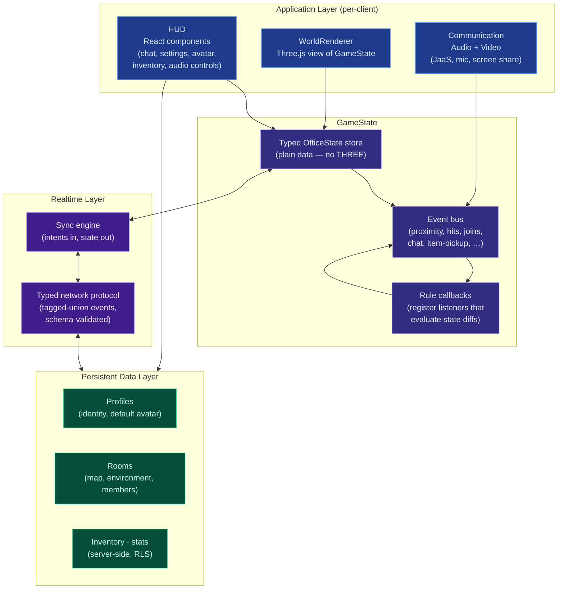

# OfficeXR Refactor Plan

> Set of architectural designs for the next major refactor of OfficeXR.
> Reads top-to-bottom — each doc assumes the previous one. Cross-references
> ARCHITECTURE.md observations (`O1`–`O11`) where relevant.

## Why refactor

OfficeXR is, at its heart, a **voice-and-chat tool with a 3D world wrapped
around it**. Today, the architecture inverts that priority: a 1,339-line
`RoomScene.tsx` owns the animation loop, multiplexes 25+ realtime event
types, threads refs into nine hooks that each `import * as THREE`, and
treats voice (Jitsi) as one more proximity-driven side-effect of the
render loop. If the renderer hiccups, everything is at risk — including
the call you are on.

The refactor reframes the system around three priorities, in order:

1. **Voice & chat must be bulletproof.** Audio/video is a first-class
   subsystem that survives renderer crashes, tab throttling, and
   GameState bugs.
2. **GameState is the single source of truth.** A typed, headless store
   that emits events. Everything else — renderer, HUD, voice, network —
   subscribes to it. Logic stops depending on Three.js.
3. **Each layer is independently testable and replaceable.** The web
   client and mobile client should share simulation; the renderer
   should be swappable; voice should not be coupled to the scene graph.

## Goals

- Decouple **rendering** (Three.js) from **simulation** (GameState).
- Decouple **voice/video** from rendering — voice subscribes to
  GameState events, not to scene-graph proximity probes.
- Replace ad-hoc broadcast strings with a **typed event protocol**.
- Make GameState **reconstitutable** for late joiners via a
  snapshot-on-join handoff so two clients in the same room converge
  without each having to observe the room's full history.
- Move "earned" persistence (inventory, kills) off `localStorage` and
  onto Postgres behind RLS.
- Shrink `RoomScene.tsx` to a thin composition root.

## Non-goals

- Not introducing a custom backend service. Supabase + JaaS remains
  the substrate.
- Not switching renderers. Three.js stays; only its boundaries move.
- Not adopting a heavy game engine (PlayCanvas, Babylon, Bevy-on-WASM).
- Not redesigning the database schema beyond moving inventory/economy
  data out of `localStorage`.
- Not building anti-cheat. Authority is documented and enforceable
  where cheap; full server-authoritative simulation is out of scope.

## Layer summary

## Document index

| # | Doc | Topic |
|---|-----|-------|
| 00 | [overview](./00-overview.md) | Target architecture, critical isolation invariant, package boundaries |
| 01 | [application-layer](./01-application-layer.md) | HUD, WorldRenderer, Audio/Video split |
| 02 | [game-state](./02-game-state.md) | Typed store, event bus, rule callbacks, proximity example |
| 03 | [realtime-layer](./03-realtime-layer.md) | Typed protocol, snapshot-on-join, delta-triggered position with velocity, authority |
| 04 | [persistent-data-layer](./04-persistent-data-layer.md) | Profiles, rooms, inventory, what moves off `localStorage` |
| 05 | [migration-plan](./05-migration-plan.md) | Concrete sequencing tied to existing observations |

## Mapping to ARCHITECTURE.md observations

| Observation | Addressed in |
|-------------|--------------|
| O1. No game-state model | [02-game-state](./02-game-state.md) |
| O2. Simulation/render fused | [01-application-layer](./01-application-layer.md), [02-game-state](./02-game-state.md) |
| O3. ref/state mirror footgun | [02-game-state](./02-game-state.md) |
| O4. Three.js leaks into hooks | [01-application-layer](./01-application-layer.md) |
| O5. `RoomScene` god component | [01-application-layer](./01-application-layer.md), [05-migration-plan](./05-migration-plan.md) |
| O6. Untyped network grab-bag | [03-realtime-layer](./03-realtime-layer.md) |
| O7. Ad-hoc multiplayer authority | [03-realtime-layer](./03-realtime-layer.md) |
| O8. Persistence split by trust | [04-persistent-data-layer](./04-persistent-data-layer.md) |
| O9. Cross-platform duplication | [00-overview](./00-overview.md), [05-migration-plan](./05-migration-plan.md) |
| O10. Performance ceilings | [03-realtime-layer](./03-realtime-layer.md), [05-migration-plan](./05-migration-plan.md) |
| O11. Integration tests missing | [02-game-state](./02-game-state.md), [05-migration-plan](./05-migration-plan.md) |
